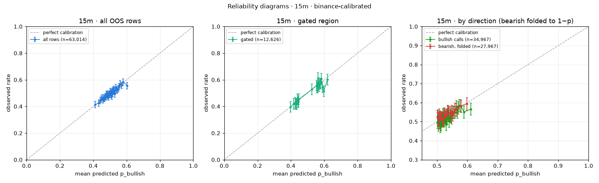
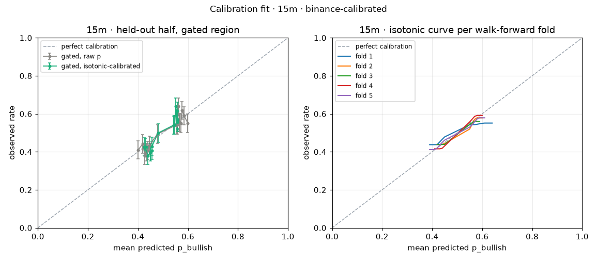

# Probability calibration · 15m · binance-calibrated

Model version `ed70c6ce`, calibrator version `ed70c6ce-20260916T140543Z`, fitted 2026-09-16T14:05:43Z. Labels: **binance-calibrated**.

## Labels and data

| Item | Value |
| --- | --- |
| Label mode | **binance** (binance-calibrated) |
| Label source | Binance candle: close ≥ open of the predicted candle |
| Note | No settlement file at data/settlement_labels_15m.csv; Binance fallback. The Chainlink TWAP-60 referee differs (drag ~0.3 pt). |
| OOS rows available | 63,014 (walk-forward, point-in-time; live rows and in-sample predictions excluded) |
| Rows skipped (no label) | 0 |
| Ties counted as up (close = open) | 29 |
| Rows used | 63,014, 2024-11-20 → 2026-09-08 |
| Gated region | agree AND \|ta.score\| ≥ 5 AND (p ≥ 0.55 or p ≤ 0.45); TA weight total 14 |
| Gated rows | 12,626 (20.0%) |

## Part 1 · Reliability diagrams

Equal-count bins, at least 100 rows per bin, bin count scaling with n. "Diagonal in CI" marks bins whose mean predicted p lies inside the Wilson 95% CI of the observed rate.

### All rows (63,014, 40 bins) · ECE 1.02%

| Bin | p range | n | Mean predicted | Observed | Wilson 95% CI | Gap (pt) | Diagonal in CI |
| ---: | --- | ---: | ---: | ---: | --- | ---: | --- |
| 1 | 0.348–0.425 | 1,576 | 41.1% | 41.3% | 38.9%–43.8% | +0.2 | ✓ |
| 2 | 0.425–0.437 | 1,576 | 43.2% | 42.5% | 40.1%–45.0% | -0.7 | ✓ |
| 3 | 0.437–0.445 | 1,576 | 44.1% | 44.4% | 41.9%–46.8% | +0.2 | ✓ |
| 4 | 0.445–0.452 | 1,576 | 44.8% | 45.5% | 43.1%–48.0% | +0.7 | ✓ |
| 5 | 0.452–0.457 | 1,576 | 45.4% | 46.6% | 44.1%–49.0% | +1.1 | ✓ |
| 6 | 0.457–0.462 | 1,576 | 45.9% | 44.9% | 42.4%–47.3% | -1.1 | ✓ |
| 7 | 0.462–0.466 | 1,576 | 46.4% | 46.1% | 43.6%–48.5% | -0.3 | ✓ |
| 8 | 0.466–0.470 | 1,576 | 46.8% | 46.2% | 43.7%–48.7% | -0.6 | ✓ |
| 9 | 0.470–0.474 | 1,576 | 47.2% | 47.2% | 44.8%–49.7% | -0.0 | ✓ |
| 10 | 0.474–0.478 | 1,576 | 47.6% | 47.3% | 44.8%–49.7% | -0.3 | ✓ |
| 11 | 0.478–0.481 | 1,576 | 47.9% | 48.7% | 46.2%–51.1% | +0.7 | ✓ |
| 12 | 0.481–0.484 | 1,576 | 48.3% | 49.2% | 46.8%–51.7% | +1.0 | ✓ |
| 13 | 0.484–0.487 | 1,576 | 48.6% | 48.0% | 45.5%–50.4% | -0.6 | ✓ |
| 14 | 0.487–0.490 | 1,576 | 48.9% | 48.5% | 46.1%–51.0% | -0.3 | ✓ |
| 15 | 0.490–0.493 | 1,575 | 49.1% | 47.2% | 44.8%–49.7% | -1.9 | ✓ |
| 16 | 0.493–0.496 | 1,575 | 49.4% | 49.3% | 46.8%–51.7% | -0.2 | ✓ |
| 17 | 0.496–0.498 | 1,575 | 49.7% | 49.3% | 46.9%–51.8% | -0.3 | ✓ |
| 18 | 0.498–0.500 | 1,575 | 49.9% | 49.1% | 46.7%–51.6% | -0.8 | ✓ |
| 19 | 0.500–0.503 | 1,575 | 50.2% | 51.1% | 48.6%–53.6% | +0.9 | ✓ |
| 20 | 0.503–0.505 | 1,575 | 50.4% | 50.5% | 48.0%–52.9% | +0.1 | ✓ |
| 21 | 0.505–0.508 | 1,575 | 50.7% | 48.9% | 46.4%–51.4% | -1.8 | ✓ |
| 22 | 0.508–0.510 | 1,575 | 50.9% | 50.1% | 47.6%–52.6% | -0.8 | ✓ |
| 23 | 0.510–0.512 | 1,575 | 51.1% | 47.8% | 45.4%–50.3% | -3.3 | ✗ |
| 24 | 0.512–0.515 | 1,575 | 51.4% | 51.2% | 48.7%–53.6% | -0.2 | ✓ |
| 25 | 0.515–0.517 | 1,575 | 51.6% | 50.0% | 47.6%–52.5% | -1.6 | ✓ |
| 26 | 0.517–0.520 | 1,575 | 51.9% | 51.9% | 49.4%–54.3% | +0.0 | ✓ |
| 27 | 0.520–0.522 | 1,575 | 52.1% | 53.0% | 50.5%–55.4% | +0.8 | ✓ |
| 28 | 0.522–0.525 | 1,575 | 52.4% | 51.5% | 49.0%–54.0% | -0.9 | ✓ |
| 29 | 0.525–0.528 | 1,575 | 52.7% | 51.7% | 49.2%–54.1% | -1.0 | ✓ |
| 30 | 0.528–0.531 | 1,575 | 52.9% | 49.4% | 46.9%–51.9% | -3.6 | ✗ |
| 31 | 0.531–0.534 | 1,575 | 53.3% | 52.3% | 49.8%–54.7% | -1.0 | ✓ |
| 32 | 0.534–0.538 | 1,575 | 53.6% | 54.3% | 51.8%–56.7% | +0.7 | ✓ |
| 33 | 0.538–0.542 | 1,575 | 54.0% | 52.2% | 49.7%–54.6% | -1.8 | ✓ |
| 34 | 0.542–0.547 | 1,575 | 54.5% | 52.6% | 50.2%–55.1% | -1.8 | ✓ |
| 35 | 0.547–0.552 | 1,575 | 54.9% | 53.3% | 50.9%–55.8% | -1.6 | ✓ |
| 36 | 0.552–0.558 | 1,575 | 55.5% | 54.7% | 52.2%–57.1% | -0.8 | ✓ |
| 37 | 0.558–0.565 | 1,575 | 56.2% | 56.8% | 54.4%–59.3% | +0.7 | ✓ |
| 38 | 0.565–0.574 | 1,575 | 56.9% | 55.8% | 53.3%–58.2% | -1.1 | ✓ |
| 39 | 0.574–0.587 | 1,575 | 58.0% | 58.3% | 55.9%–60.8% | +0.4 | ✓ |
| 40 | 0.587–0.669 | 1,575 | 60.3% | 55.7% | 53.2%–58.1% | -4.6 | ✗ |

### Gated rows (12,626, 22 bins) · ECE 1.63%

| Bin | p range | n | Mean predicted | Observed | Wilson 95% CI | Gap (pt) | Diagonal in CI |
| ---: | --- | ---: | ---: | ---: | --- | ---: | --- |
| 1 | 0.348–0.410 | 574 | 39.7% | 39.5% | 35.6%–43.6% | -0.2 | ✓ |
| 2 | 0.410–0.421 | 574 | 41.6% | 42.0% | 38.0%–46.1% | +0.4 | ✓ |
| 3 | 0.421–0.427 | 574 | 42.4% | 42.7% | 38.7%–46.8% | +0.3 | ✓ |
| 4 | 0.427–0.432 | 574 | 43.0% | 42.0% | 38.0%–46.1% | -1.0 | ✓ |
| 5 | 0.432–0.437 | 574 | 43.5% | 41.6% | 37.7%–45.7% | -1.8 | ✓ |
| 6 | 0.437–0.440 | 574 | 43.9% | 45.3% | 41.3%–49.4% | +1.4 | ✓ |
| 7 | 0.440–0.444 | 574 | 44.2% | 42.9% | 38.9%–46.9% | -1.4 | ✓ |
| 8 | 0.444–0.447 | 574 | 44.5% | 43.9% | 39.9%–48.0% | -0.6 | ✓ |
| 9 | 0.447–0.449 | 574 | 44.8% | 45.5% | 41.4%–49.6% | +0.7 | ✓ |
| 10 | 0.449–0.552 | 574 | 52.6% | 52.8% | 48.7%–56.8% | +0.2 | ✓ |
| 11 | 0.552–0.555 | 574 | 55.3% | 55.7% | 51.7%–59.8% | +0.4 | ✓ |
| 12 | 0.555–0.558 | 574 | 55.6% | 54.2% | 50.1%–58.2% | -1.5 | ✓ |
| 13 | 0.558–0.561 | 574 | 55.9% | 54.5% | 50.4%–58.6% | -1.4 | ✓ |
| 14 | 0.561–0.564 | 574 | 56.2% | 61.3% | 57.3%–65.2% | +5.1 | ✗ |
| 15 | 0.564–0.567 | 574 | 56.6% | 56.1% | 52.0%–60.1% | -0.5 | ✓ |
| 16 | 0.567–0.571 | 574 | 56.9% | 55.2% | 51.1%–59.2% | -1.7 | ✓ |
| 17 | 0.571–0.575 | 574 | 57.3% | 57.1% | 53.1%–61.1% | -0.1 | ✓ |
| 18 | 0.575–0.579 | 574 | 57.7% | 57.1% | 53.1%–61.1% | -0.5 | ✓ |
| 19 | 0.579–0.584 | 574 | 58.2% | 60.8% | 56.7%–64.7% | +2.6 | ✓ |
| 20 | 0.584–0.592 | 574 | 58.8% | 54.5% | 50.4%–58.6% | -4.2 | ✗ |
| 21 | 0.592–0.604 | 573 | 59.7% | 51.5% | 47.4%–55.6% | -8.2 | ✗ |
| 22 | 0.604–0.669 | 573 | 61.9% | 60.2% | 56.1%–64.1% | -1.7 | ✓ |

### By call direction · bullish calls (p > 0.5), 34,967 rows · ECE 1.64%

| Bin | p range | n | Mean predicted | Observed | Wilson 95% CI | Gap (pt) | Diagonal in CI |
| ---: | --- | ---: | ---: | ---: | --- | ---: | --- |
| 1 | 0.500–0.501 | 946 | 50.1% | 49.6% | 46.4%–52.8% | -0.5 | ✓ |
| 2 | 0.501–0.503 | 946 | 50.2% | 53.1% | 49.9%–56.2% | +2.8 | ✓ |
| 3 | 0.503–0.504 | 945 | 50.4% | 50.6% | 47.4%–53.8% | +0.2 | ✓ |
| 4 | 0.504–0.506 | 945 | 50.5% | 49.0% | 45.8%–52.2% | -1.5 | ✓ |
| 5 | 0.506–0.507 | 945 | 50.7% | 50.4% | 47.2%–53.6% | -0.3 | ✓ |
| 6 | 0.507–0.509 | 945 | 50.8% | 49.5% | 46.3%–52.7% | -1.3 | ✓ |
| 7 | 0.509–0.510 | 945 | 50.9% | 49.6% | 46.4%–52.8% | -1.3 | ✓ |
| 8 | 0.510–0.512 | 945 | 51.1% | 47.3% | 44.1%–50.5% | -3.8 | ✗ |
| 9 | 0.512–0.513 | 945 | 51.2% | 50.4% | 47.2%–53.6% | -0.9 | ✓ |
| 10 | 0.513–0.514 | 945 | 51.4% | 48.4% | 45.2%–51.5% | -3.0 | ✓ |
| 11 | 0.514–0.516 | 945 | 51.5% | 51.9% | 48.7%–55.0% | +0.3 | ✓ |
| 12 | 0.516–0.517 | 945 | 51.7% | 50.5% | 47.3%–53.7% | -1.2 | ✓ |
| 13 | 0.517–0.519 | 945 | 51.8% | 52.1% | 48.9%–55.2% | +0.2 | ✓ |
| 14 | 0.519–0.520 | 945 | 52.0% | 53.8% | 50.6%–56.9% | +1.8 | ✓ |
| 15 | 0.520–0.522 | 945 | 52.1% | 50.4% | 47.2%–53.6% | -1.8 | ✓ |
| 16 | 0.522–0.524 | 945 | 52.3% | 54.0% | 50.8%–57.1% | +1.7 | ✓ |
| 17 | 0.524–0.525 | 945 | 52.4% | 50.4% | 47.2%–53.6% | -2.1 | ✓ |
| 18 | 0.525–0.527 | 945 | 52.6% | 52.6% | 49.4%–55.8% | -0.0 | ✓ |
| 19 | 0.527–0.529 | 945 | 52.8% | 51.3% | 48.1%–54.5% | -1.5 | ✓ |
| 20 | 0.529–0.530 | 945 | 52.9% | 48.6% | 45.4%–51.8% | -4.4 | ✗ |
| 21 | 0.530–0.532 | 945 | 53.1% | 51.3% | 48.1%–54.5% | -1.8 | ✓ |
| 22 | 0.532–0.534 | 945 | 53.3% | 51.7% | 48.6%–54.9% | -1.6 | ✓ |
| 23 | 0.534–0.536 | 945 | 53.5% | 55.6% | 52.4%–58.7% | +2.0 | ✓ |
| 24 | 0.536–0.539 | 945 | 53.8% | 53.0% | 49.8%–56.2% | -0.8 | ✓ |
| 25 | 0.539–0.541 | 945 | 54.0% | 50.3% | 47.1%–53.4% | -3.7 | ✗ |
| 26 | 0.541–0.544 | 945 | 54.3% | 52.8% | 49.6%–56.0% | -1.5 | ✓ |
| 27 | 0.544–0.547 | 945 | 54.5% | 53.5% | 50.4%–56.7% | -1.0 | ✓ |
| 28 | 0.547–0.550 | 945 | 54.8% | 52.0% | 48.8%–55.1% | -2.9 | ✓ |
| 29 | 0.550–0.553 | 945 | 55.2% | 55.0% | 51.8%–58.2% | -0.1 | ✓ |
| 30 | 0.553–0.557 | 945 | 55.5% | 54.8% | 51.6%–58.0% | -0.7 | ✓ |
| 31 | 0.557–0.561 | 945 | 55.9% | 54.9% | 51.7%–58.1% | -1.0 | ✓ |
| 32 | 0.561–0.565 | 945 | 56.3% | 58.0% | 54.8%–61.1% | +1.7 | ✓ |
| 33 | 0.565–0.570 | 945 | 56.8% | 54.9% | 51.7%–58.1% | -1.8 | ✓ |
| 34 | 0.570–0.576 | 945 | 57.3% | 58.5% | 55.3%–61.6% | +1.2 | ✓ |
| 35 | 0.576–0.583 | 945 | 57.9% | 58.0% | 54.8%–61.1% | +0.0 | ✓ |
| 36 | 0.583–0.595 | 945 | 58.9% | 55.0% | 51.8%–58.2% | -3.8 | ✗ |
| 37 | 0.595–0.669 | 945 | 61.1% | 56.6% | 53.4%–59.7% | -4.5 | ✗ |

### By call direction · bearish calls folded to 1−p, 27,967 rows · ECE 0.85%

| Bin | p range | n | Mean predicted | Observed | Wilson 95% CI | Gap (pt) | Diagonal in CI |
| ---: | --- | ---: | ---: | ---: | --- | ---: | --- |
| 1 | 0.500–0.501 | 848 | 50.1% | 52.4% | 49.0%–55.7% | +2.3 | ✓ |
| 2 | 0.501–0.503 | 848 | 50.2% | 51.4% | 48.1%–54.8% | +1.2 | ✓ |
| 3 | 0.503–0.504 | 848 | 50.3% | 51.3% | 47.9%–54.6% | +1.0 | ✓ |
| 4 | 0.504–0.506 | 848 | 50.5% | 48.2% | 44.9%–51.6% | -2.3 | ✓ |
| 5 | 0.506–0.507 | 848 | 50.6% | 51.8% | 48.4%–55.1% | +1.1 | ✓ |
| 6 | 0.507–0.508 | 848 | 50.8% | 53.3% | 49.9%–56.6% | +2.5 | ✓ |
| 7 | 0.508–0.510 | 848 | 50.9% | 52.2% | 48.9%–55.6% | +1.3 | ✓ |
| 8 | 0.510–0.512 | 848 | 51.1% | 50.9% | 47.6%–54.3% | -0.1 | ✓ |
| 9 | 0.512–0.513 | 848 | 51.2% | 52.2% | 48.9%–55.6% | +1.0 | ✓ |
| 10 | 0.513–0.515 | 848 | 51.4% | 51.1% | 47.7%–54.4% | -0.3 | ✓ |
| 11 | 0.515–0.516 | 848 | 51.5% | 51.5% | 48.2%–54.9% | -0.0 | ✓ |
| 12 | 0.516–0.518 | 848 | 51.7% | 51.3% | 47.9%–54.6% | -0.4 | ✓ |
| 13 | 0.518–0.520 | 848 | 51.9% | 50.4% | 47.0%–53.7% | -1.5 | ✓ |
| 14 | 0.520–0.522 | 848 | 52.1% | 51.4% | 48.1%–54.8% | -0.7 | ✓ |
| 15 | 0.522–0.524 | 848 | 52.3% | 52.4% | 49.0%–55.7% | +0.1 | ✓ |
| 16 | 0.524–0.526 | 848 | 52.5% | 53.9% | 50.5%–57.2% | +1.4 | ✓ |
| 17 | 0.526–0.528 | 847 | 52.6% | 53.1% | 49.8%–56.5% | +0.5 | ✓ |
| 18 | 0.528–0.530 | 847 | 52.9% | 52.3% | 48.9%–55.6% | -0.6 | ✓ |
| 19 | 0.530–0.532 | 847 | 53.1% | 53.4% | 50.0%–56.7% | +0.3 | ✓ |
| 20 | 0.532–0.534 | 847 | 53.3% | 53.5% | 50.1%–56.8% | +0.2 | ✓ |
| 21 | 0.534–0.536 | 847 | 53.5% | 54.9% | 51.5%–58.2% | +1.4 | ✓ |
| 22 | 0.536–0.539 | 847 | 53.7% | 54.1% | 50.7%–57.4% | +0.3 | ✓ |
| 23 | 0.539–0.541 | 847 | 54.0% | 54.7% | 51.3%–58.0% | +0.7 | ✓ |
| 24 | 0.541–0.544 | 847 | 54.3% | 54.5% | 51.2%–57.9% | +0.3 | ✓ |
| 25 | 0.544–0.547 | 847 | 54.5% | 52.7% | 49.3%–56.0% | -1.9 | ✓ |
| 26 | 0.547–0.550 | 847 | 54.8% | 55.4% | 52.0%–58.7% | +0.5 | ✓ |
| 27 | 0.550–0.553 | 847 | 55.2% | 53.7% | 50.4%–57.1% | -1.4 | ✓ |
| 28 | 0.553–0.557 | 847 | 55.5% | 54.9% | 51.5%–58.2% | -0.6 | ✓ |
| 29 | 0.557–0.561 | 847 | 55.9% | 56.4% | 53.1%–59.7% | +0.5 | ✓ |
| 30 | 0.561–0.567 | 847 | 56.4% | 56.1% | 52.7%–59.4% | -0.3 | ✓ |
| 31 | 0.567–0.574 | 847 | 57.0% | 57.3% | 53.9%–60.6% | +0.3 | ✓ |
| 32 | 0.574–0.585 | 847 | 57.8% | 58.3% | 55.0%–61.6% | +0.5 | ✓ |
| 33 | 0.585–0.652 | 847 | 59.8% | 59.4% | 56.0%–62.6% | -0.4 | ✓ |

**Direction asymmetry:** calibration gap (observed − predicted) is -0.99 pt for bullish calls and +0.21 pt for folded bearish calls; z = -2.99 → **the two directions calibrate differently** (|z| ≥ 2).

## Part 2 · Calibrator fit

Fit on the first half of the OOS period (2024-11-20 → 2025-10-15, 31,507 rows), evaluated on the second half (2025-10-15 → 2026-09-08, 31,507 rows, 6,109 gated).

Primary calibrator: isotonic regression fitted to equal-count bin means with ≥ 1000 rows per step ("binned isotonic"). Plain isotonic on individual rows and Platt scaling are shown for comparison.

| Metric (held-out half) | Raw p | Isotonic (binned, primary) | Isotonic (plain) | Platt |
| --- | ---: | ---: | ---: | ---: |
| Brier score | 0.24848 | 0.24855 | 0.24860 | 0.24852 |
| ECE, all rows | 1.32% | 1.45% | 1.41% | 1.47% |
| ECE, gated rows | 2.74% | 2.59% | 2.74% | 2.88% |

**Read this honestly:** the calibrator changes the held-out Brier score by -0.00007, which is within noise: the raw score is already close to calibrated on this interval, and the top-tier drift seen in Part 1 does not repeat consistently enough between halves to correct.

**Top tier** (most confident held-out calls, folded, n=900): raw said **59.9%** → got **56.8%** (CI 53.5%–60.0%); after isotonic said 57.3% → got 58.0%.

**Gated bins after calibration:** 10 of 15 bins have the diagonal inside the CI → **FAIL**.

### Held-out reliability, gated rows, raw p

| Bin | p range | n | Mean predicted | Observed | Wilson 95% CI | Gap (pt) | Diagonal in CI |
| ---: | --- | ---: | ---: | ---: | --- | ---: | --- |
| 1 | 0.348–0.413 | 408 | 40.1% | 40.9% | 36.3%–45.8% | +0.9 | ✓ |
| 2 | 0.413–0.424 | 408 | 41.9% | 44.1% | 39.4%–49.0% | +2.2 | ✓ |
| 3 | 0.424–0.431 | 408 | 42.8% | 38.0% | 33.4%–42.8% | -4.8 | ✓ |
| 4 | 0.431–0.437 | 408 | 43.4% | 39.7% | 35.1%–44.5% | -3.7 | ✓ |
| 5 | 0.437–0.443 | 407 | 44.0% | 40.5% | 35.9%–45.4% | -3.5 | ✓ |
| 6 | 0.443–0.447 | 407 | 44.5% | 43.2% | 38.5%–48.1% | -1.3 | ✓ |
| 7 | 0.447–0.551 | 407 | 47.8% | 49.4% | 44.6%–54.2% | +1.6 | ✓ |
| 8 | 0.551–0.555 | 407 | 55.3% | 54.1% | 49.2%–58.8% | -1.3 | ✓ |
| 9 | 0.555–0.560 | 407 | 55.7% | 54.3% | 49.4%–59.1% | -1.4 | ✓ |
| 10 | 0.560–0.564 | 407 | 56.2% | 63.9% | 59.1%–68.4% | +7.7 | ✗ |
| 11 | 0.564–0.569 | 407 | 56.6% | 55.5% | 50.7%–60.3% | -1.1 | ✓ |
| 12 | 0.569–0.574 | 407 | 57.1% | 55.0% | 50.2%–59.8% | -2.1 | ✓ |
| 13 | 0.574–0.580 | 407 | 57.7% | 61.9% | 57.1%–66.5% | +4.2 | ✓ |
| 14 | 0.580–0.590 | 407 | 58.5% | 59.0% | 54.1%–63.6% | +0.5 | ✓ |
| 15 | 0.590–0.642 | 407 | 60.0% | 55.0% | 50.2%–59.8% | -4.9 | ✗ |

### Held-out reliability, gated rows, after isotonic

| Bin | p range | n | Mean predicted | Observed | Wilson 95% CI | Gap (pt) | Diagonal in CI |
| ---: | --- | ---: | ---: | ---: | --- | ---: | --- |
| 1 | 0.425–0.425 | 408 | 42.5% | 42.6% | 37.9%–47.5% | +0.2 | ✓ |
| 2 | 0.425–0.435 | 408 | 42.9% | 42.4% | 37.7%–47.2% | -0.5 | ✓ |
| 3 | 0.435–0.445 | 408 | 44.0% | 38.0% | 33.4%–42.8% | -6.0 | ✗ |
| 4 | 0.445–0.454 | 408 | 45.0% | 39.7% | 35.1%–44.5% | -5.2 | ✗ |
| 5 | 0.454–0.456 | 407 | 45.6% | 40.5% | 35.9%–45.4% | -5.0 | ✗ |
| 6 | 0.456–0.456 | 407 | 45.6% | 42.8% | 38.0%–47.6% | -2.8 | ✓ |
| 7 | 0.456–0.542 | 407 | 48.0% | 49.9% | 45.0%–54.7% | +1.8 | ✓ |
| 8 | 0.542–0.545 | 407 | 54.3% | 54.1% | 49.2%–58.8% | -0.3 | ✓ |
| 9 | 0.545–0.549 | 407 | 54.7% | 54.3% | 49.4%–59.1% | -0.4 | ✓ |
| 10 | 0.549–0.554 | 407 | 55.2% | 63.9% | 59.1%–68.4% | +8.7 | ✗ |
| 11 | 0.554–0.558 | 407 | 55.7% | 55.5% | 50.7%–60.3% | -0.2 | ✓ |
| 12 | 0.558–0.558 | 407 | 55.8% | 55.8% | 50.9%–60.5% | -0.1 | ✓ |
| 13 | 0.558–0.558 | 407 | 55.8% | 61.4% | 56.6%–66.0% | +5.6 | ✗ |
| 14 | 0.558–0.558 | 407 | 55.8% | 57.2% | 52.4%–62.0% | +1.4 | ✓ |
| 15 | 0.558–0.558 | 407 | 55.8% | 56.5% | 51.7%–61.2% | +0.7 | ✓ |

### Held-out reliability, all rows, after isotonic

| Bin | p range | n | Mean predicted | Observed | Wilson 95% CI | Gap (pt) | Diagonal in CI |
| ---: | --- | ---: | ---: | ---: | --- | ---: | --- |
| 1 | 0.425–0.436 | 901 | 42.7% | 41.8% | 38.7%–45.1% | -0.9 | ✓ |
| 2 | 0.436–0.455 | 901 | 44.6% | 41.1% | 37.9%–44.3% | -3.5 | ✗ |
| 3 | 0.455–0.456 | 901 | 45.6% | 41.6% | 38.4%–44.9% | -4.0 | ✗ |
| 4 | 0.456–0.457 | 901 | 45.6% | 46.1% | 42.8%–49.3% | +0.4 | ✓ |
| 5 | 0.457–0.457 | 901 | 45.7% | 46.4% | 43.2%–49.7% | +0.7 | ✓ |
| 6 | 0.457–0.457 | 901 | 45.7% | 46.3% | 43.0%–49.5% | +0.6 | ✓ |
| 7 | 0.457–0.467 | 901 | 46.1% | 46.5% | 43.3%–49.8% | +0.4 | ✓ |
| 8 | 0.467–0.477 | 900 | 47.2% | 47.0% | 43.8%–50.3% | -0.2 | ✓ |
| 9 | 0.477–0.481 | 900 | 48.0% | 47.6% | 44.3%–50.8% | -0.5 | ✓ |
| 10 | 0.481–0.481 | 900 | 48.1% | 47.6% | 44.3%–50.8% | -0.5 | ✓ |
| 11 | 0.481–0.481 | 900 | 48.1% | 48.9% | 45.6%–52.2% | +0.8 | ✓ |
| 12 | 0.481–0.481 | 900 | 48.1% | 46.9% | 43.6%–50.2% | -1.2 | ✓ |
| 13 | 0.481–0.481 | 900 | 48.1% | 48.9% | 45.6%–52.2% | +0.8 | ✓ |
| 14 | 0.481–0.486 | 900 | 48.3% | 50.8% | 47.5%–54.0% | +2.5 | ✓ |
| 15 | 0.486–0.494 | 900 | 49.0% | 50.7% | 47.4%–53.9% | +1.7 | ✓ |
| 16 | 0.494–0.501 | 900 | 49.9% | 45.3% | 42.1%–48.6% | -4.6 | ✗ |
| 17 | 0.501–0.501 | 900 | 50.1% | 50.0% | 46.7%–53.3% | -0.1 | ✓ |
| 18 | 0.501–0.501 | 900 | 50.1% | 49.0% | 45.7%–52.3% | -1.1 | ✓ |
| 19 | 0.501–0.501 | 900 | 50.1% | 51.8% | 48.5%–55.0% | +1.7 | ✓ |
| 20 | 0.501–0.501 | 900 | 50.1% | 48.0% | 44.8%–51.3% | -2.1 | ✓ |
| 21 | 0.501–0.504 | 900 | 50.2% | 51.2% | 48.0%–54.5% | +1.0 | ✓ |
| 22 | 0.504–0.511 | 900 | 50.7% | 49.6% | 46.3%–52.8% | -1.2 | ✓ |
| 23 | 0.511–0.520 | 900 | 51.6% | 52.2% | 49.0%–55.5% | +0.6 | ✓ |
| 24 | 0.520–0.520 | 900 | 52.0% | 51.1% | 47.8%–54.4% | -0.9 | ✓ |
| 25 | 0.520–0.520 | 900 | 52.0% | 56.3% | 53.1%–59.5% | +4.4 | ✗ |
| 26 | 0.520–0.520 | 900 | 52.0% | 52.9% | 49.6%–56.1% | +0.9 | ✓ |
| 27 | 0.520–0.520 | 900 | 52.0% | 52.7% | 49.4%–55.9% | +0.7 | ✓ |
| 28 | 0.520–0.520 | 900 | 52.0% | 52.8% | 49.5%–56.0% | +0.8 | ✓ |
| 29 | 0.520–0.520 | 900 | 52.0% | 49.0% | 45.7%–52.3% | -3.0 | ✓ |
| 30 | 0.520–0.521 | 900 | 52.0% | 51.7% | 48.4%–54.9% | -0.3 | ✓ |
| 31 | 0.521–0.542 | 900 | 53.2% | 51.8% | 48.5%–55.0% | -1.4 | ✓ |
| 32 | 0.542–0.549 | 900 | 54.5% | 54.4% | 51.2%–57.7% | -0.0 | ✓ |
| 33 | 0.549–0.558 | 900 | 55.4% | 59.0% | 55.8%–62.2% | +3.6 | ✗ |
| 34 | 0.558–0.558 | 900 | 55.8% | 57.4% | 54.2%–60.6% | +1.6 | ✓ |
| 35 | 0.558–0.558 | 900 | 55.8% | 57.9% | 54.6%–61.1% | +2.0 | ✓ |

### Stability across walk-forward folds

| Fold | Period | n | Mean p | Observed | Brier raw | ECE raw | p range |
| --- | ---: | ---: | ---: | ---: | ---: | ---: | ---: |
| 1 | 2024-11-20 → 2025-03-27 | 12,201 | 50.9% | 50.2% | 0.24935 | 2.64% | 0.368–0.669 |
| 2 | 2025-03-28 → 2025-08-06 | 12,603 | 50.5% | 49.6% | 0.24897 | 1.91% | 0.372–0.644 |
| 3 | 2025-08-06 → 2025-12-15 | 12,603 | 50.5% | 49.9% | 0.24880 | 1.29% | 0.409–0.594 |
| 4 | 2025-12-15 → 2026-04-25 | 12,603 | 50.5% | 50.2% | 0.24800 | 1.55% | 0.394–0.617 |
| 5 | 2026-04-25 → 2026-09-08 | 13,004 | 50.1% | 49.3% | 0.24882 | 2.00% | 0.348–0.642 |

**Verdict:** NOT stable: fold curves differ by up to 4.7 pt where both folds have support (folds 1 vs 4 at p=0.45). The calibrator therefore refits automatically at every retrain and backtest of this interval (built into `main.py train` and `main.py backtest`).

## Part 3 · Deployed calibrator

Isotonic regression on all 63,014 OOS rows, version `ed70c6ce-20260916T140543Z`, stored at `calibrators/p_bullish_15m_ed70c6ce-20260916T140543Z.json` and served as `models/15m/calibration.json`. Exposed in `/api/predict?interval=15m` as `ml.p_bullish_cal`, `ml.calibration_version`, `ml.calibration_labels`, `ml.calibration_n`; full lookup at `/api/calibration/15m`.

| Raw p | Calibrated p |
| --- | ---: |
| 0.000 | 0.4096 |
| 0.050 | 0.4096 |
| 0.100 | 0.4096 |
| 0.150 | 0.4096 |
| 0.200 | 0.4096 |
| 0.250 | 0.4096 |
| 0.300 | 0.4096 |
| 0.350 | 0.4096 |
| 0.400 | 0.4096 |
| 0.450 | 0.4567 |
| 0.500 | 0.4948 |
| 0.550 | 0.5371 |
| 0.600 | 0.5717 |
| 0.650 | 0.5717 |
| 0.700 | 0.5717 |
| 0.750 | 0.5717 |
| 0.800 | 0.5717 |
| 0.850 | 0.5717 |
| 0.900 | 0.5717 |
| 0.950 | 0.5717 |
| 1.000 | 0.5717 |

**Caveat.** The OOS rows come from the walk-forward fold models; the deployed model is retrained on all data and can be sharper or flatter than those folds, so the calibrator is best read as calibrating the *modelling recipe* until live rows accumulate.

