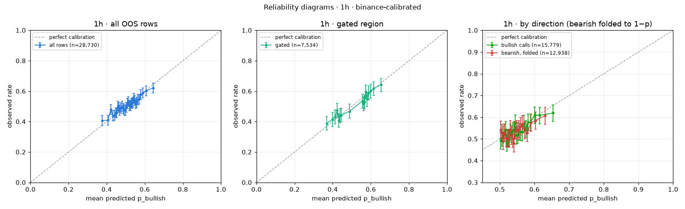
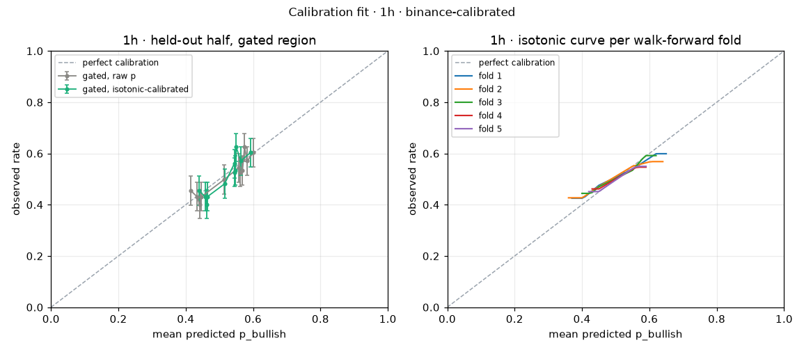

# Probability calibration · 1h · binance-calibrated

Model version `814576a7`, calibrator version `814576a7-20260916T140544Z`, fitted 2026-09-16T14:05:44Z. Labels: **binance-calibrated**.

## Labels and data

| Item | Value |
| --- | --- |
| Label mode | **binance** (binance-calibrated) |
| Label source | Binance candle: close ≥ open of the predicted candle |
| Note | Binance 1H candle is the Polymarket referee for this interval; settlement file optional. |
| OOS rows available | 28,730 (walk-forward, point-in-time; live rows and in-sample predictions excluded) |
| Rows skipped (no label) | 0 |
| Ties counted as up (close = open) | 3 |
| Rows used | 28,730, 2023-05-30 → 2026-09-08 |
| Gated region | agree AND \|ta.score\| ≥ 5 AND (p ≥ 0.55 or p ≤ 0.45); TA weight total 16 |
| Gated rows | 7,534 (26.2%) |

## Part 1 · Reliability diagrams

Equal-count bins, at least 100 rows per bin, bin count scaling with n. "Diagonal in CI" marks bins whose mean predicted p lies inside the Wilson 95% CI of the observed rate.

### All rows (28,730, 33 bins) · ECE 1.58%

| Bin | p range | n | Mean predicted | Observed | Wilson 95% CI | Gap (pt) | Diagonal in CI |
| ---: | --- | ---: | ---: | ---: | --- | ---: | --- |
| 1 | 0.296–0.397 | 871 | 37.7% | 40.5% | 37.3%–43.8% | +2.9 | ✓ |
| 2 | 0.397–0.416 | 871 | 40.7% | 41.0% | 37.8%–44.3% | +0.3 | ✓ |
| 3 | 0.416–0.428 | 871 | 42.2% | 48.0% | 44.7%–51.3% | +5.8 | ✗ |
| 4 | 0.428–0.438 | 871 | 43.3% | 43.7% | 40.5%–47.1% | +0.4 | ✓ |
| 5 | 0.438–0.444 | 871 | 44.1% | 44.1% | 40.8%–47.4% | -0.0 | ✓ |
| 6 | 0.444–0.450 | 871 | 44.7% | 45.8% | 42.5%–49.1% | +1.1 | ✓ |
| 7 | 0.450–0.456 | 871 | 45.3% | 45.7% | 42.4%–49.0% | +0.4 | ✓ |
| 8 | 0.456–0.461 | 871 | 45.8% | 50.2% | 46.9%–53.5% | +4.4 | ✗ |
| 9 | 0.461–0.466 | 871 | 46.3% | 49.3% | 45.9%–52.6% | +2.9 | ✓ |
| 10 | 0.466–0.471 | 871 | 46.9% | 47.5% | 44.2%–50.9% | +0.7 | ✓ |
| 11 | 0.471–0.478 | 871 | 47.5% | 48.9% | 45.6%–52.2% | +1.4 | ✓ |
| 12 | 0.478–0.483 | 871 | 48.0% | 49.9% | 46.6%–53.3% | +1.9 | ✓ |
| 13 | 0.483–0.490 | 871 | 48.7% | 48.7% | 45.4%–52.0% | +0.0 | ✓ |
| 14 | 0.490–0.495 | 871 | 49.2% | 47.8% | 44.5%–51.1% | -1.5 | ✓ |
| 15 | 0.495–0.501 | 871 | 49.8% | 47.3% | 44.0%–50.6% | -2.5 | ✓ |
| 16 | 0.501–0.506 | 871 | 50.4% | 49.3% | 45.9%–52.6% | -1.1 | ✓ |
| 17 | 0.506–0.511 | 871 | 50.9% | 51.9% | 48.6%–55.2% | +1.0 | ✓ |
| 18 | 0.511–0.516 | 871 | 51.4% | 53.0% | 49.7%–56.3% | +1.6 | ✓ |
| 19 | 0.516–0.521 | 871 | 51.9% | 50.7% | 47.4%–54.1% | -1.1 | ✓ |
| 20 | 0.521–0.526 | 871 | 52.4% | 50.5% | 47.2%–53.8% | -1.8 | ✓ |
| 21 | 0.526–0.530 | 870 | 52.8% | 52.0% | 48.6%–55.3% | -0.9 | ✓ |
| 22 | 0.530–0.535 | 870 | 53.2% | 52.0% | 48.6%–55.3% | -1.3 | ✓ |
| 23 | 0.535–0.539 | 870 | 53.7% | 52.8% | 49.4%–56.1% | -1.0 | ✓ |
| 24 | 0.539–0.544 | 870 | 54.2% | 55.4% | 52.1%–58.7% | +1.2 | ✓ |
| 25 | 0.544–0.549 | 870 | 54.7% | 53.9% | 50.6%–57.2% | -0.8 | ✓ |
| 26 | 0.549–0.555 | 870 | 55.2% | 51.7% | 48.4%–55.0% | -3.5 | ✗ |
| 27 | 0.555–0.561 | 870 | 55.8% | 52.8% | 49.4%–56.1% | -3.0 | ✓ |
| 28 | 0.561–0.568 | 870 | 56.4% | 54.4% | 51.0%–57.7% | -2.1 | ✓ |
| 29 | 0.568–0.575 | 870 | 57.1% | 54.8% | 51.5%–58.1% | -2.3 | ✓ |
| 30 | 0.575–0.584 | 870 | 57.9% | 57.8% | 54.5%–61.1% | -0.1 | ✓ |
| 31 | 0.584–0.597 | 870 | 59.0% | 58.7% | 55.4%–62.0% | -0.2 | ✓ |
| 32 | 0.597–0.617 | 870 | 60.6% | 60.1% | 56.8%–63.3% | -0.5 | ✓ |
| 33 | 0.617–0.745 | 870 | 64.5% | 62.2% | 58.9%–65.3% | -2.3 | ✓ |

### Gated rows (7,534, 17 bins) · ECE 1.95%

| Bin | p range | n | Mean predicted | Observed | Wilson 95% CI | Gap (pt) | Diagonal in CI |
| ---: | --- | ---: | ---: | ---: | --- | ---: | --- |
| 1 | 0.296–0.389 | 444 | 37.0% | 38.7% | 34.3%–43.3% | +1.8 | ✓ |
| 2 | 0.389–0.406 | 444 | 39.8% | 41.4% | 37.0%–46.1% | +1.6 | ✓ |
| 3 | 0.406–0.418 | 444 | 41.2% | 43.0% | 38.5%–47.7% | +1.8 | ✓ |
| 4 | 0.418–0.428 | 443 | 42.4% | 47.4% | 42.8%–52.1% | +5.0 | ✗ |
| 5 | 0.429–0.436 | 443 | 43.2% | 40.6% | 36.2%–45.3% | -2.6 | ✓ |
| 6 | 0.436–0.442 | 443 | 43.9% | 43.8% | 39.2%–48.4% | -0.1 | ✓ |
| 7 | 0.442–0.447 | 443 | 44.5% | 44.2% | 39.7%–48.9% | -0.2 | ✓ |
| 8 | 0.447–0.552 | 443 | 48.7% | 46.7% | 42.1%–51.4% | -2.0 | ✓ |
| 9 | 0.552–0.558 | 443 | 55.5% | 53.5% | 48.8%–58.1% | -2.0 | ✓ |
| 10 | 0.558–0.564 | 443 | 56.1% | 51.7% | 47.0%–56.3% | -4.5 | ✓ |
| 11 | 0.564–0.570 | 443 | 56.7% | 52.8% | 48.2%–57.4% | -3.9 | ✓ |
| 12 | 0.570–0.576 | 443 | 57.3% | 59.6% | 55.0%–64.1% | +2.3 | ✓ |
| 13 | 0.576–0.583 | 443 | 58.0% | 54.6% | 50.0%–59.2% | -3.3 | ✓ |
| 14 | 0.584–0.593 | 443 | 58.8% | 58.9% | 54.3%–63.4% | +0.1 | ✓ |
| 15 | 0.593–0.606 | 443 | 60.0% | 60.0% | 55.4%–64.5% | +0.1 | ✓ |
| 16 | 0.606–0.627 | 443 | 61.5% | 61.9% | 57.2%–66.3% | +0.3 | ✓ |
| 17 | 0.627–0.745 | 443 | 65.5% | 64.1% | 59.5%–68.4% | -1.4 | ✓ |

### By call direction · bullish calls (p > 0.5), 15,779 rows · ECE 1.74%

| Bin | p range | n | Mean predicted | Observed | Wilson 95% CI | Gap (pt) | Diagonal in CI |
| ---: | --- | ---: | ---: | ---: | --- | ---: | --- |
| 1 | 0.500–0.504 | 632 | 50.2% | 49.2% | 45.3%–53.1% | -1.0 | ✓ |
| 2 | 0.504–0.508 | 632 | 50.6% | 50.5% | 46.6%–54.4% | -0.1 | ✓ |
| 3 | 0.508–0.512 | 632 | 51.0% | 52.1% | 48.2%–55.9% | +1.1 | ✓ |
| 4 | 0.512–0.515 | 632 | 51.3% | 53.0% | 49.1%–56.9% | +1.7 | ✓ |
| 5 | 0.515–0.519 | 631 | 51.7% | 54.2% | 50.3%–58.1% | +2.5 | ✓ |
| 6 | 0.519–0.522 | 631 | 52.1% | 48.2% | 44.3%–52.1% | -3.9 | ✓ |
| 7 | 0.522–0.526 | 631 | 52.4% | 50.6% | 46.7%–54.4% | -1.8 | ✓ |
| 8 | 0.526–0.529 | 631 | 52.7% | 50.4% | 46.5%–54.3% | -2.3 | ✓ |
| 9 | 0.529–0.532 | 631 | 53.0% | 52.9% | 49.0%–56.8% | -0.1 | ✓ |
| 10 | 0.532–0.535 | 631 | 53.4% | 52.3% | 48.4%–56.2% | -1.1 | ✓ |
| 11 | 0.535–0.539 | 631 | 53.7% | 53.7% | 49.8%–57.6% | +0.0 | ✓ |
| 12 | 0.539–0.542 | 631 | 54.1% | 54.2% | 50.3%–58.1% | +0.1 | ✓ |
| 13 | 0.542–0.546 | 631 | 54.4% | 57.4% | 53.5%–61.2% | +3.0 | ✓ |
| 14 | 0.546–0.550 | 631 | 54.8% | 51.5% | 47.6%–55.4% | -3.3 | ✓ |
| 15 | 0.550–0.554 | 631 | 55.2% | 51.8% | 47.9%–55.7% | -3.3 | ✓ |
| 16 | 0.554–0.558 | 631 | 55.6% | 53.2% | 49.3%–57.1% | -2.3 | ✓ |
| 17 | 0.558–0.562 | 631 | 56.0% | 53.2% | 49.3%–57.1% | -2.7 | ✓ |
| 18 | 0.562–0.567 | 631 | 56.5% | 53.1% | 49.2%–57.0% | -3.4 | ✓ |
| 19 | 0.567–0.572 | 631 | 57.0% | 57.1% | 53.2%–60.9% | +0.1 | ✓ |
| 20 | 0.572–0.578 | 631 | 57.5% | 54.5% | 50.6%–58.4% | -3.0 | ✓ |
| 21 | 0.578–0.585 | 631 | 58.1% | 57.7% | 53.8%–61.5% | -0.4 | ✓ |
| 22 | 0.585–0.594 | 631 | 58.9% | 57.7% | 53.8%–61.5% | -1.2 | ✓ |
| 23 | 0.594–0.607 | 631 | 60.0% | 61.0% | 57.2%–64.7% | +1.0 | ✓ |
| 24 | 0.607–0.626 | 631 | 61.5% | 60.9% | 57.0%–64.6% | -0.7 | ✓ |
| 25 | 0.626–0.745 | 631 | 65.4% | 62.0% | 58.1%–65.7% | -3.4 | ✓ |

### By call direction · bearish calls folded to 1−p, 12,938 rows · ECE 2.08%

| Bin | p range | n | Mean predicted | Observed | Wilson 95% CI | Gap (pt) | Diagonal in CI |
| ---: | --- | ---: | ---: | ---: | --- | ---: | --- |
| 1 | 0.500–0.504 | 589 | 50.2% | 54.3% | 50.3%–58.3% | +4.1 | ✗ |
| 2 | 0.504–0.507 | 589 | 50.6% | 52.8% | 48.8%–56.8% | +2.2 | ✓ |
| 3 | 0.507–0.511 | 588 | 50.9% | 49.1% | 45.1%–53.2% | -1.8 | ✓ |
| 4 | 0.511–0.516 | 588 | 51.3% | 52.7% | 48.7%–56.7% | +1.4 | ✓ |
| 5 | 0.516–0.520 | 588 | 51.8% | 50.3% | 46.3%–54.4% | -1.4 | ✓ |
| 6 | 0.520–0.524 | 588 | 52.2% | 50.5% | 46.5%–54.5% | -1.7 | ✓ |
| 7 | 0.524–0.528 | 588 | 52.6% | 50.2% | 46.1%–54.2% | -2.4 | ✓ |
| 8 | 0.528–0.532 | 588 | 53.0% | 54.4% | 50.4%–58.4% | +1.5 | ✓ |
| 9 | 0.532–0.535 | 588 | 53.3% | 51.5% | 47.5%–55.5% | -1.8 | ✓ |
| 10 | 0.535–0.539 | 588 | 53.7% | 50.2% | 46.1%–54.2% | -3.5 | ✓ |
| 11 | 0.539–0.542 | 588 | 54.1% | 48.0% | 43.9%–52.0% | -6.1 | ✗ |
| 12 | 0.542–0.546 | 588 | 54.4% | 53.9% | 49.9%–57.9% | -0.5 | ✓ |
| 13 | 0.546–0.549 | 588 | 54.8% | 54.4% | 50.4%–58.4% | -0.3 | ✓ |
| 14 | 0.549–0.553 | 588 | 55.1% | 53.7% | 49.7%–57.7% | -1.4 | ✓ |
| 15 | 0.553–0.557 | 588 | 55.5% | 54.4% | 50.4%–58.4% | -1.1 | ✓ |
| 16 | 0.557–0.562 | 588 | 56.0% | 55.8% | 51.7%–59.7% | -0.2 | ✓ |
| 17 | 0.562–0.568 | 588 | 56.5% | 56.8% | 52.8%–60.7% | +0.3 | ✓ |
| 18 | 0.568–0.575 | 588 | 57.2% | 54.1% | 50.0%–58.1% | -3.1 | ✓ |
| 19 | 0.575–0.584 | 588 | 58.0% | 52.7% | 48.7%–56.7% | -5.2 | ✗ |
| 20 | 0.584–0.595 | 588 | 59.0% | 57.5% | 53.5%–61.4% | -1.5 | ✓ |
| 21 | 0.595–0.613 | 588 | 60.3% | 58.5% | 54.5%–62.4% | -1.8 | ✓ |
| 22 | 0.613–0.704 | 588 | 63.1% | 60.7% | 56.7%–64.6% | -2.4 | ✓ |

**Direction asymmetry:** calibration gap (observed − predicted) is -0.99 pt for bullish calls and -1.21 pt for folded bearish calls; z = +0.38 → no material difference (|z| < 2).

## Part 2 · Calibrator fit

Fit on the first half of the OOS period (2023-05-30 → 2025-01-17, 14,365 rows), evaluated on the second half (2025-01-17 → 2026-09-08, 14,365 rows, 3,261 gated).

Primary calibrator: isotonic regression fitted to equal-count bin means with ≥ 1000 rows per step ("binned isotonic"). Plain isotonic on individual rows and Platt scaling are shown for comparison.

| Metric (held-out half) | Raw p | Isotonic (binned, primary) | Isotonic (plain) | Platt |
| --- | ---: | ---: | ---: | ---: |
| Brier score | 0.24866 | 0.24873 | 0.24880 | 0.24873 |
| ECE, all rows | 1.87% | 2.05% | 1.85% | 2.03% |
| ECE, gated rows | 2.38% | 2.84% | 3.14% | 2.71% |

**Read this honestly:** the calibrator changes the held-out Brier score by -0.00007, which is within noise: the raw score is already close to calibrated on this interval, and the top-tier drift seen in Part 1 does not repeat consistently enough between halves to correct.

**Top tier** (most confident held-out calls, folded, n=624): raw said **59.6%** → got **60.7%** (CI 56.9%–64.5%); after isotonic said 58.3% → got 60.7%.

**Gated bins after calibration:** 9 of 11 bins have the diagonal inside the CI → **FAIL**.

### Held-out reliability, gated rows, raw p

| Bin | p range | n | Mean predicted | Observed | Wilson 95% CI | Gap (pt) | Diagonal in CI |
| ---: | --- | ---: | ---: | ---: | --- | ---: | --- |
| 1 | 0.382–0.428 | 297 | 41.5% | 45.5% | 39.9%–51.1% | +3.9 | ✓ |
| 2 | 0.428–0.438 | 297 | 43.4% | 43.1% | 37.6%–48.8% | -0.3 | ✓ |
| 3 | 0.438–0.444 | 297 | 44.1% | 40.1% | 34.7%–45.7% | -4.1 | ✓ |
| 4 | 0.444–0.449 | 297 | 44.6% | 43.1% | 37.6%–48.8% | -1.5 | ✓ |
| 5 | 0.449–0.553 | 297 | 51.4% | 49.8% | 44.2%–55.5% | -1.6 | ✓ |
| 6 | 0.553–0.559 | 296 | 55.7% | 54.4% | 48.7%–60.0% | -1.3 | ✓ |
| 7 | 0.559–0.565 | 296 | 56.2% | 52.7% | 47.0%–58.3% | -3.5 | ✓ |
| 8 | 0.565–0.571 | 296 | 56.8% | 53.4% | 47.7%–59.0% | -3.5 | ✓ |
| 9 | 0.571–0.578 | 296 | 57.5% | 62.5% | 56.9%–67.8% | +5.0 | ✓ |
| 10 | 0.578–0.588 | 296 | 58.2% | 57.1% | 51.4%–62.6% | -1.1 | ✓ |
| 11 | 0.588–0.638 | 296 | 60.2% | 60.5% | 54.8%–65.9% | +0.3 | ✓ |

### Held-out reliability, gated rows, after isotonic

| Bin | p range | n | Mean predicted | Observed | Wilson 95% CI | Gap (pt) | Diagonal in CI |
| ---: | --- | ---: | ---: | ---: | --- | ---: | --- |
| 1 | 0.409–0.453 | 297 | 44.0% | 45.5% | 39.9%–51.1% | +1.5 | ✓ |
| 2 | 0.453–0.460 | 297 | 45.8% | 43.1% | 37.6%–48.8% | -2.7 | ✓ |
| 3 | 0.460–0.463 | 297 | 46.2% | 40.1% | 34.7%–45.7% | -6.1 | ✗ |
| 4 | 0.463–0.465 | 297 | 46.4% | 43.1% | 37.6%–48.8% | -3.3 | ✓ |
| 5 | 0.465–0.544 | 297 | 51.5% | 48.1% | 42.5%–53.8% | -3.4 | ✓ |
| 6 | 0.544–0.545 | 296 | 54.4% | 56.1% | 50.4%–61.6% | +1.6 | ✓ |
| 7 | 0.545–0.546 | 296 | 54.6% | 52.7% | 47.0%–58.3% | -1.9 | ✓ |
| 8 | 0.546–0.548 | 296 | 54.7% | 53.4% | 47.7%–59.0% | -1.4 | ✓ |
| 9 | 0.548–0.554 | 296 | 55.0% | 62.5% | 56.9%–67.8% | +7.5 | ✗ |
| 10 | 0.554–0.575 | 296 | 56.3% | 57.1% | 51.4%–62.6% | +0.8 | ✓ |
| 11 | 0.575–0.615 | 296 | 59.3% | 60.5% | 54.8%–65.9% | +1.1 | ✓ |

### Held-out reliability, all rows, after isotonic

| Bin | p range | n | Mean predicted | Observed | Wilson 95% CI | Gap (pt) | Diagonal in CI |
| ---: | --- | ---: | ---: | ---: | --- | ---: | --- |
| 1 | 0.409–0.459 | 625 | 44.8% | 43.7% | 39.8%–47.6% | -1.1 | ✓ |
| 2 | 0.459–0.464 | 625 | 46.2% | 44.0% | 40.2%–47.9% | -2.2 | ✓ |
| 3 | 0.464–0.469 | 625 | 46.5% | 43.2% | 39.4%–47.1% | -3.3 | ✓ |
| 4 | 0.469–0.482 | 625 | 47.6% | 47.7% | 43.8%–51.6% | +0.1 | ✓ |
| 5 | 0.482–0.495 | 625 | 48.8% | 49.6% | 45.7%–53.5% | +0.8 | ✓ |
| 6 | 0.495–0.500 | 625 | 49.9% | 47.2% | 43.3%–51.1% | -2.7 | ✓ |
| 7 | 0.500–0.500 | 625 | 50.0% | 51.7% | 47.8%–55.6% | +1.7 | ✓ |
| 8 | 0.500–0.500 | 625 | 50.0% | 46.9% | 43.0%–50.8% | -3.1 | ✓ |
| 9 | 0.500–0.500 | 625 | 50.0% | 43.8% | 40.0%–47.8% | -6.1 | ✗ |
| 10 | 0.500–0.505 | 625 | 50.1% | 48.0% | 44.1%–51.9% | -2.1 | ✓ |
| 11 | 0.505–0.517 | 625 | 51.1% | 47.7% | 43.8%–51.6% | -3.4 | ✓ |
| 12 | 0.517–0.527 | 625 | 52.2% | 52.8% | 48.9%–56.7% | +0.6 | ✓ |
| 13 | 0.527–0.527 | 625 | 52.7% | 50.6% | 46.6%–54.5% | -2.2 | ✓ |
| 14 | 0.527–0.527 | 624 | 52.7% | 51.6% | 47.7%–55.5% | -1.1 | ✓ |
| 15 | 0.527–0.529 | 624 | 52.8% | 51.4% | 47.5%–55.3% | -1.3 | ✓ |
| 16 | 0.529–0.535 | 624 | 53.2% | 51.3% | 47.4%–55.2% | -1.9 | ✓ |
| 17 | 0.535–0.541 | 624 | 53.8% | 51.6% | 47.7%–55.5% | -2.2 | ✓ |
| 18 | 0.541–0.544 | 624 | 54.4% | 53.2% | 49.3%–57.1% | -1.2 | ✓ |
| 19 | 0.544–0.544 | 624 | 54.4% | 53.0% | 49.1%–56.9% | -1.4 | ✓ |
| 20 | 0.544–0.545 | 624 | 54.4% | 53.7% | 49.8%–57.6% | -0.8 | ✓ |
| 21 | 0.545–0.547 | 624 | 54.6% | 51.9% | 48.0%–55.8% | -2.7 | ✓ |
| 22 | 0.547–0.557 | 624 | 55.0% | 57.7% | 53.8%–61.5% | +2.7 | ✓ |
| 23 | 0.557–0.615 | 624 | 58.0% | 60.6% | 56.7%–64.3% | +2.5 | ✓ |

### Stability across walk-forward folds

| Fold | Period | n | Mean p | Observed | Brier raw | ECE raw | p range |
| --- | ---: | ---: | ---: | ---: | ---: | ---: | ---: |
| 1 | 2023-05-30 → 2024-01-20 | 5,652 | 51.0% | 51.3% | 0.24647 | 2.34% | 0.296–0.745 |
| 2 | 2024-01-20 → 2024-09-16 | 5,746 | 50.1% | 50.8% | 0.24770 | 2.38% | 0.336–0.710 |
| 3 | 2024-09-16 → 2025-05-13 | 5,746 | 50.8% | 51.1% | 0.24772 | 2.44% | 0.358–0.675 |
| 4 | 2025-05-13 → 2026-01-07 | 5,746 | 50.7% | 50.4% | 0.24899 | 2.48% | 0.408–0.614 |
| 5 | 2026-01-07 → 2026-09-08 | 5,840 | 50.7% | 49.8% | 0.24861 | 1.84% | 0.412–0.602 |

**Verdict:** NOT stable: fold curves differ by up to 4.5 pt where both folds have support (folds 3 vs 4 at p=0.59). The calibrator therefore refits automatically at every retrain and backtest of this interval (built into `main.py train` and `main.py backtest`).

## Part 3 · Deployed calibrator

Isotonic regression on all 28,730 OOS rows, version `814576a7-20260916T140544Z`, stored at `calibrators/p_bullish_1h_814576a7-20260916T140544Z.json` and served as `models/1h/calibration.json`. Exposed in `/api/predict?interval=1h` as `ml.p_bullish_cal`, `ml.calibration_version`, `ml.calibration_labels`, `ml.calibration_n`; full lookup at `/api/calibration/1h`.

| Raw p | Calibrated p |
| --- | ---: |
| 0.000 | 0.4041 |
| 0.050 | 0.4041 |
| 0.100 | 0.4041 |
| 0.150 | 0.4041 |
| 0.200 | 0.4041 |
| 0.250 | 0.4041 |
| 0.300 | 0.4041 |
| 0.350 | 0.4041 |
| 0.400 | 0.4207 |
| 0.450 | 0.4582 |
| 0.500 | 0.4891 |
| 0.550 | 0.5361 |
| 0.600 | 0.6041 |
| 0.650 | 0.6179 |
| 0.700 | 0.6179 |
| 0.750 | 0.6179 |
| 0.800 | 0.6179 |
| 0.850 | 0.6179 |
| 0.900 | 0.6179 |
| 0.950 | 0.6179 |
| 1.000 | 0.6179 |

**Caveat.** The OOS rows come from the walk-forward fold models; the deployed model is retrained on all data and can be sharper or flatter than those folds, so the calibrator is best read as calibrating the *modelling recipe* until live rows accumulate.

