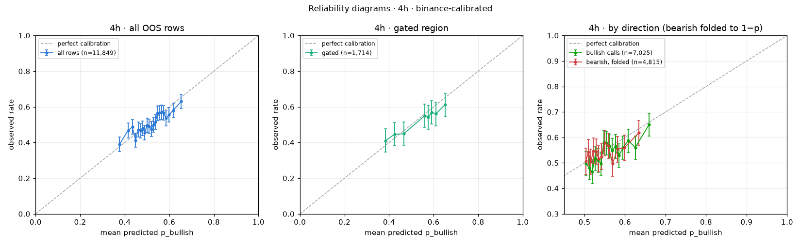
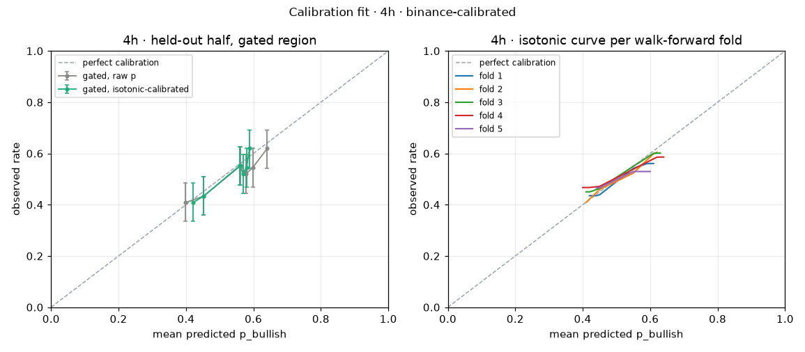

# Probability calibration · 4h · binance-calibrated

Model version `ec96032d`, calibrator version `ec96032d-20260916T140544Z`, fitted 2026-09-16T14:05:44Z. Labels: **binance-calibrated**.

## Labels and data

| Item | Value |
| --- | --- |
| Label mode | **binance** (binance-calibrated) |
| Label source | Binance candle: close ≥ open of the predicted candle |
| Note | Referee NOT YET VERIFIED for 4h; Binance fallback used. Treat as provisional. |
| OOS rows available | 11,849 (walk-forward, point-in-time; live rows and in-sample predictions excluded) |
| Rows skipped (no label) | 0 |
| Ties counted as up (close = open) | 0 |
| Rows used | 11,849, 2021-04-14 → 2026-09-10 |
| Gated region | agree AND \|ta.score\| ≥ 3 AND (p ≥ 0.55 or p ≤ 0.45); TA weight total 9 → threshold ceil(0.30 × 9) = 3 |
| Gated rows | 1,714 (14.5%) |

## Part 1 · Reliability diagrams

Equal-count bins, at least 100 rows per bin, bin count scaling with n. "Diagonal in CI" marks bins whose mean predicted p lies inside the Wilson 95% CI of the observed rate.

### All rows (11,849, 21 bins) · ECE 2.50%

| Bin | p range | n | Mean predicted | Observed | Wilson 95% CI | Gap (pt) | Diagonal in CI |
| ---: | --- | ---: | ---: | ---: | --- | ---: | --- |
| 1 | 0.299–0.402 | 565 | 37.6% | 38.9% | 35.0%–43.0% | +1.3 | ✓ |
| 2 | 0.402–0.425 | 565 | 41.5% | 46.7% | 42.6%–50.8% | +5.2 | ✗ |
| 3 | 0.425–0.442 | 565 | 43.4% | 48.7% | 44.6%–52.8% | +5.2 | ✗ |
| 4 | 0.442–0.455 | 565 | 44.9% | 41.2% | 37.3%–45.3% | -3.6 | ✓ |
| 5 | 0.455–0.466 | 565 | 46.0% | 47.3% | 43.2%–51.4% | +1.2 | ✓ |
| 6 | 0.466–0.476 | 564 | 47.1% | 46.6% | 42.6%–50.8% | -0.5 | ✓ |
| 7 | 0.476–0.485 | 564 | 48.1% | 47.9% | 43.8%–52.0% | -0.2 | ✓ |
| 8 | 0.485–0.495 | 564 | 49.0% | 45.6% | 41.5%–49.7% | -3.4 | ✓ |
| 9 | 0.495–0.505 | 564 | 50.0% | 49.6% | 45.5%–53.8% | -0.3 | ✓ |
| 10 | 0.505–0.514 | 564 | 50.9% | 48.9% | 44.8%–53.1% | -2.0 | ✓ |
| 11 | 0.514–0.523 | 564 | 51.9% | 47.5% | 43.4%–51.6% | -4.4 | ✗ |
| 12 | 0.523–0.533 | 564 | 52.8% | 49.8% | 45.7%–53.9% | -3.0 | ✓ |
| 13 | 0.533–0.542 | 564 | 53.8% | 51.4% | 47.3%–55.5% | -2.4 | ✓ |
| 14 | 0.542–0.551 | 564 | 54.6% | 56.4% | 52.3%–60.4% | +1.7 | ✓ |
| 15 | 0.551–0.560 | 564 | 55.5% | 56.6% | 52.4%–60.6% | +1.0 | ✓ |
| 16 | 0.560–0.569 | 564 | 56.5% | 57.1% | 53.0%–61.1% | +0.6 | ✓ |
| 17 | 0.569–0.579 | 564 | 57.4% | 56.6% | 52.4%–60.6% | -0.9 | ✓ |
| 18 | 0.579–0.591 | 564 | 58.5% | 53.5% | 49.4%–57.6% | -5.0 | ✗ |
| 19 | 0.591–0.607 | 564 | 59.9% | 55.5% | 51.4%–59.5% | -4.4 | ✗ |
| 20 | 0.607–0.629 | 564 | 61.7% | 58.0% | 53.9%–62.0% | -3.7 | ✓ |
| 21 | 0.629–0.739 | 564 | 65.4% | 63.1% | 59.1%–67.0% | -2.3 | ✓ |

### Gated rows (1,714, 8 bins) · ECE 2.72%

| Bin | p range | n | Mean predicted | Observed | Wilson 95% CI | Gap (pt) | Diagonal in CI |
| ---: | --- | ---: | ---: | ---: | --- | ---: | --- |
| 1 | 0.302–0.411 | 215 | 38.3% | 40.9% | 34.6%–47.6% | +2.6 | ✓ |
| 2 | 0.411–0.436 | 215 | 42.5% | 44.7% | 38.2%–51.3% | +2.2 | ✓ |
| 3 | 0.436–0.554 | 214 | 46.6% | 44.9% | 38.3%–51.6% | -1.8 | ✓ |
| 4 | 0.554–0.568 | 214 | 56.1% | 55.1% | 48.4%–61.7% | -0.9 | ✓ |
| 5 | 0.568–0.583 | 214 | 57.6% | 54.2% | 47.5%–60.7% | -3.4 | ✓ |
| 6 | 0.583–0.599 | 214 | 59.1% | 57.0% | 50.3%–63.5% | -2.1 | ✓ |
| 7 | 0.599–0.625 | 214 | 61.0% | 56.1% | 49.4%–62.6% | -4.9 | ✓ |
| 8 | 0.625–0.739 | 214 | 65.1% | 61.2% | 54.5%–67.5% | -3.9 | ✓ |

### By call direction · bullish calls (p > 0.5), 7,025 rows · ECE 2.80%

| Bin | p range | n | Mean predicted | Observed | Wilson 95% CI | Gap (pt) | Diagonal in CI |
| ---: | --- | ---: | ---: | ---: | --- | ---: | --- |
| 1 | 0.500–0.508 | 440 | 50.4% | 49.8% | 45.1%–54.4% | -0.6 | ✓ |
| 2 | 0.508–0.515 | 439 | 51.1% | 48.1% | 43.4%–52.7% | -3.1 | ✓ |
| 3 | 0.515–0.522 | 439 | 51.9% | 46.5% | 41.9%–51.1% | -5.4 | ✗ |
| 4 | 0.522–0.529 | 439 | 52.6% | 51.7% | 47.0%–56.3% | -0.9 | ✓ |
| 5 | 0.529–0.537 | 439 | 53.3% | 51.0% | 46.4%–55.7% | -2.3 | ✓ |
| 6 | 0.537–0.544 | 439 | 54.1% | 49.7% | 45.0%–54.3% | -4.4 | ✓ |
| 7 | 0.544–0.551 | 439 | 54.7% | 58.1% | 53.4%–62.6% | +3.3 | ✓ |
| 8 | 0.551–0.558 | 439 | 55.4% | 57.9% | 53.2%–62.4% | +2.4 | ✓ |
| 9 | 0.558–0.565 | 439 | 56.1% | 56.7% | 52.0%–61.3% | +0.6 | ✓ |
| 10 | 0.565–0.572 | 439 | 56.9% | 54.9% | 50.2%–59.5% | -2.0 | ✓ |
| 11 | 0.573–0.581 | 439 | 57.6% | 56.5% | 51.8%–61.1% | -1.2 | ✓ |
| 12 | 0.581–0.590 | 439 | 58.5% | 52.8% | 48.2%–57.5% | -5.7 | ✗ |
| 13 | 0.590–0.601 | 439 | 59.5% | 56.0% | 51.4%–60.6% | -3.5 | ✓ |
| 14 | 0.601–0.615 | 439 | 60.8% | 58.8% | 54.1%–63.3% | -2.0 | ✓ |
| 15 | 0.615–0.637 | 439 | 62.5% | 56.0% | 51.4%–60.6% | -6.5 | ✗ |
| 16 | 0.637–0.739 | 439 | 66.0% | 65.1% | 60.6%–69.5% | -0.8 | ✓ |

### By call direction · bearish calls folded to 1−p, 4,815 rows · ECE 2.45%

| Bin | p range | n | Mean predicted | Observed | Wilson 95% CI | Gap (pt) | Diagonal in CI |
| ---: | --- | ---: | ---: | ---: | --- | ---: | --- |
| 1 | 0.500–0.506 | 371 | 50.3% | 50.7% | 45.6%–55.7% | +0.4 | ✓ |
| 2 | 0.506–0.513 | 371 | 51.0% | 54.2% | 49.1%–59.2% | +3.2 | ✓ |
| 3 | 0.513–0.519 | 371 | 51.6% | 50.4% | 45.3%–55.5% | -1.2 | ✓ |
| 4 | 0.519–0.525 | 371 | 52.2% | 54.7% | 49.6%–59.7% | +2.5 | ✓ |
| 5 | 0.525–0.531 | 371 | 52.8% | 54.4% | 49.4%–59.4% | +1.6 | ✓ |
| 6 | 0.531–0.539 | 370 | 53.5% | 51.6% | 46.5%–56.7% | -1.9 | ✓ |
| 7 | 0.539–0.546 | 370 | 54.2% | 52.4% | 47.3%–57.5% | -1.8 | ✓ |
| 8 | 0.546–0.554 | 370 | 55.0% | 57.8% | 52.8%–62.8% | +2.8 | ✓ |
| 9 | 0.554–0.563 | 370 | 55.9% | 56.8% | 51.7%–61.7% | +0.9 | ✓ |
| 10 | 0.563–0.575 | 370 | 56.9% | 49.7% | 44.7%–54.8% | -7.2 | ✗ |
| 11 | 0.575–0.589 | 370 | 58.2% | 55.4% | 50.3%–60.4% | -2.8 | ✓ |
| 12 | 0.589–0.610 | 370 | 59.9% | 55.9% | 50.9%–60.9% | -3.9 | ✓ |
| 13 | 0.610–0.701 | 370 | 63.4% | 61.9% | 56.8%–66.7% | -1.6 | ✓ |

**Direction asymmetry:** calibration gap (observed − predicted) is -2.00 pt for bullish calls and -0.68 pt for folded bearish calls; z = -1.41 → no material difference (|z| < 2).

## Part 2 · Calibrator fit

Fit on the first half of the OOS period (2021-04-14 → 2023-12-28, 5,924 rows), evaluated on the second half (2023-12-28 → 2026-09-10, 5,925 rows, 980 gated).

Primary calibrator: isotonic regression fitted to equal-count bin means with ≥ 1000 rows per step ("binned isotonic"). Plain isotonic on individual rows and Platt scaling are shown for comparison.

| Metric (held-out half) | Raw p | Isotonic (binned, primary) | Isotonic (plain) | Platt |
| --- | ---: | ---: | ---: | ---: |
| Brier score | 0.24845 | 0.24810 | 0.24816 | 0.24808 |
| ECE, all rows | 3.14% | 2.66% | 2.57% | 2.70% |
| ECE, gated rows | 2.84% | 2.52% | 2.35% | 1.72% |

**Read this honestly:** the calibrator changes the held-out Brier score by +0.00035, which is a real improvement.

**Top tier** (most confident held-out calls, folded, n=395): raw said **64.7%** → got **61.0%** (CI 56.1%–65.7%); after isotonic said 58.9% → got 60.8%.

**Gated bins after calibration:** 6 of 6 bins have the diagonal inside the CI → **pass**.

### Held-out reliability, gated rows, raw p

| Bin | p range | n | Mean predicted | Observed | Wilson 95% CI | Gap (pt) | Diagonal in CI |
| ---: | --- | ---: | ---: | ---: | --- | ---: | --- |
| 1 | 0.318–0.428 | 164 | 39.8% | 40.9% | 33.6%–48.5% | +1.0 | ✓ |
| 2 | 0.428–0.552 | 164 | 45.2% | 43.3% | 35.9%–50.9% | -1.9 | ✓ |
| 3 | 0.553–0.571 | 163 | 56.2% | 55.2% | 47.5%–62.6% | -1.0 | ✓ |
| 4 | 0.571–0.588 | 163 | 57.9% | 52.1% | 44.5%–59.7% | -5.8 | ✓ |
| 5 | 0.588–0.611 | 163 | 59.8% | 54.6% | 46.9%–62.1% | -5.2 | ✓ |
| 6 | 0.612–0.722 | 163 | 64.1% | 62.0% | 54.3%–69.1% | -2.1 | ✓ |

### Held-out reliability, gated rows, after isotonic

| Bin | p range | n | Mean predicted | Observed | Wilson 95% CI | Gap (pt) | Diagonal in CI |
| ---: | --- | ---: | ---: | ---: | --- | ---: | --- |
| 1 | 0.419–0.429 | 164 | 42.1% | 40.9% | 33.6%–48.5% | -1.2 | ✓ |
| 2 | 0.429–0.548 | 164 | 45.2% | 43.3% | 35.9%–50.9% | -1.9 | ✓ |
| 3 | 0.549–0.565 | 163 | 56.0% | 55.2% | 47.5%–62.6% | -0.7 | ✓ |
| 4 | 0.565–0.574 | 163 | 56.9% | 52.1% | 44.5%–59.7% | -4.8 | ✓ |
| 5 | 0.574–0.587 | 163 | 58.0% | 54.6% | 46.9%–62.1% | -3.4 | ✓ |
| 6 | 0.587–0.589 | 163 | 58.9% | 62.0% | 54.3%–69.1% | +3.1 | ✓ |

### Held-out reliability, all rows, after isotonic

| Bin | p range | n | Mean predicted | Observed | Wilson 95% CI | Gap (pt) | Diagonal in CI |
| ---: | --- | ---: | ---: | ---: | --- | ---: | --- |
| 1 | 0.419–0.419 | 395 | 41.9% | 45.6% | 40.7%–50.5% | +3.6 | ✓ |
| 2 | 0.419–0.442 | 395 | 43.1% | 48.1% | 43.2%–53.0% | +5.0 | ✗ |
| 3 | 0.442–0.457 | 395 | 44.9% | 44.1% | 39.2%–49.0% | -0.9 | ✓ |
| 4 | 0.457–0.469 | 395 | 46.3% | 49.4% | 44.5%–54.3% | +3.1 | ✓ |
| 5 | 0.469–0.478 | 395 | 47.4% | 46.1% | 41.2%–51.0% | -1.4 | ✓ |
| 6 | 0.478–0.482 | 395 | 48.0% | 44.6% | 39.7%–49.5% | -3.4 | ✓ |
| 7 | 0.482–0.487 | 395 | 48.5% | 51.6% | 46.7%–56.5% | +3.2 | ✓ |
| 8 | 0.487–0.497 | 395 | 49.0% | 45.3% | 40.5%–50.2% | -3.7 | ✓ |
| 9 | 0.497–0.524 | 395 | 51.1% | 53.4% | 48.5%–58.3% | +2.3 | ✓ |
| 10 | 0.524–0.546 | 395 | 53.5% | 55.7% | 50.8%–60.5% | +2.2 | ✓ |
| 11 | 0.546–0.561 | 395 | 55.6% | 56.5% | 51.5%–61.3% | +0.9 | ✓ |
| 12 | 0.561–0.568 | 395 | 56.5% | 54.9% | 50.0%–59.8% | -1.5 | ✓ |
| 13 | 0.568–0.576 | 395 | 57.2% | 53.4% | 48.5%–58.3% | -3.8 | ✓ |
| 14 | 0.576–0.589 | 395 | 58.2% | 55.2% | 50.3%–60.0% | -3.0 | ✓ |
| 15 | 0.589–0.589 | 395 | 58.9% | 60.8% | 55.9%–65.4% | +1.9 | ✓ |

### Stability across walk-forward folds

| Fold | Period | n | Mean p | Observed | Brier raw | ECE raw | p range |
| --- | ---: | ---: | ---: | ---: | ---: | ---: | ---: |
| 1 | 2021-04-14 → 2022-05-14 | 2,369 | 52.0% | 49.9% | 0.24792 | 3.66% | 0.363–0.659 |
| 2 | 2022-05-14 → 2023-06-13 | 2,370 | 51.1% | 50.5% | 0.24532 | 2.52% | 0.299–0.739 |
| 3 | 2023-06-13 → 2024-07-12 | 2,370 | 51.7% | 52.0% | 0.24587 | 1.96% | 0.324–0.730 |
| 4 | 2024-07-12 → 2025-08-11 | 2,370 | 52.0% | 51.8% | 0.24781 | 3.72% | 0.318–0.722 |
| 5 | 2025-08-11 → 2026-09-10 | 2,370 | 51.8% | 49.8% | 0.25026 | 3.58% | 0.412–0.626 |

**Verdict:** NOT stable: fold curves differ by up to 6.2 pt where both folds have support (folds 3 vs 5 at p=0.60). The calibrator therefore refits automatically at every retrain and backtest of this interval (built into `main.py train` and `main.py backtest`).

## Part 3 · Deployed calibrator

Isotonic regression on all 11,849 OOS rows, version `ec96032d-20260916T140544Z`, stored at `calibrators/p_bullish_4h_ec96032d-20260916T140544Z.json` and served as `models/4h/calibration.json`. Exposed in `/api/predict?interval=4h` as `ml.p_bullish_cal`, `ml.calibration_version`, `ml.calibration_labels`, `ml.calibration_n`; full lookup at `/api/calibration/4h`.

| Raw p | Calibrated p |
| --- | ---: |
| 0.000 | 0.4230 |
| 0.050 | 0.4230 |
| 0.100 | 0.4230 |
| 0.150 | 0.4230 |
| 0.200 | 0.4230 |
| 0.250 | 0.4230 |
| 0.300 | 0.4230 |
| 0.350 | 0.4230 |
| 0.400 | 0.4265 |
| 0.450 | 0.4588 |
| 0.500 | 0.4860 |
| 0.550 | 0.5501 |
| 0.600 | 0.5682 |
| 0.650 | 0.6100 |
| 0.700 | 0.6100 |
| 0.750 | 0.6100 |
| 0.800 | 0.6100 |
| 0.850 | 0.6100 |
| 0.900 | 0.6100 |
| 0.950 | 0.6100 |
| 1.000 | 0.6100 |

**Caveat.** The OOS rows come from the walk-forward fold models; the deployed model is retrained on all data and can be sharper or flatter than those folds, so the calibrator is best read as calibrating the *modelling recipe* until live rows accumulate.

