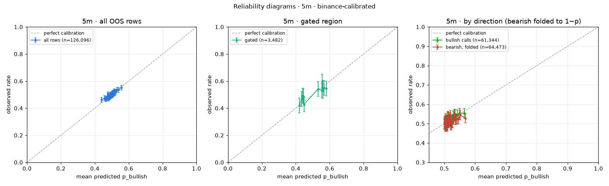
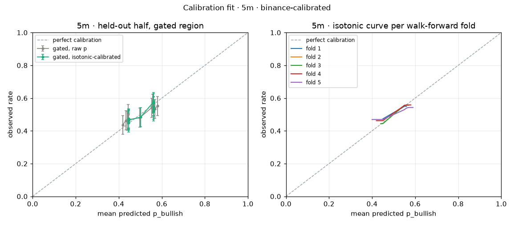

# Probability calibration · 5m · binance-calibrated

Model version `2e94e5c8`, calibrator version `2e94e5c8-20260916T140541Z`, fitted 2026-09-16T14:05:41Z. Labels: **binance-calibrated**.

## Labels and data

| Item | Value |
| --- | --- |
| Label mode | **binance** (binance-calibrated) |
| Label source | Binance candle: close ≥ open of the predicted candle |
| Note | No settlement file at data/settlement_labels_5m.csv; Binance fallback. The Chainlink TWAP-60 referee differs (drag ~1.3 pt). |
| OOS rows available | 126,096 (walk-forward, point-in-time; live rows and in-sample predictions excluded) |
| Rows skipped (no label) | 0 |
| Ties counted as up (close = open) | 414 |
| Rows used | 126,096, 2025-06-29 → 2026-09-10 |
| Gated region | agree AND \|ta.score\| ≥ 2 AND (p ≥ 0.55 or p ≤ 0.45); TA weight total 6 |
| Gated rows | 3,482 (2.8%) |

## Part 1 · Reliability diagrams

Equal-count bins, at least 100 rows per bin, bin count scaling with n. "Diagonal in CI" marks bins whose mean predicted p lies inside the Wilson 95% CI of the observed rate.

### All rows (126,096, 40 bins) · ECE 0.61%

| Bin | p range | n | Mean predicted | Observed | Wilson 95% CI | Gap (pt) | Diagonal in CI |
| ---: | --- | ---: | ---: | ---: | --- | ---: | --- |
| 1 | 0.362–0.452 | 3,153 | 44.0% | 46.2% | 44.5%–48.0% | +2.2 | ✗ |
| 2 | 0.452–0.460 | 3,153 | 45.6% | 47.4% | 45.7%–49.2% | +1.8 | ✗ |
| 3 | 0.460–0.466 | 3,153 | 46.3% | 46.8% | 45.0%–48.5% | +0.5 | ✓ |
| 4 | 0.466–0.470 | 3,153 | 46.8% | 46.9% | 45.2%–48.7% | +0.1 | ✓ |
| 5 | 0.470–0.474 | 3,153 | 47.2% | 47.4% | 45.7%–49.2% | +0.2 | ✓ |
| 6 | 0.474–0.477 | 3,153 | 47.5% | 50.3% | 48.5%–52.0% | +2.7 | ✗ |
| 7 | 0.477–0.480 | 3,153 | 47.8% | 49.4% | 47.7%–51.2% | +1.6 | ✓ |
| 8 | 0.480–0.482 | 3,153 | 48.1% | 47.1% | 45.4%–48.8% | -1.0 | ✓ |
| 9 | 0.482–0.484 | 3,153 | 48.3% | 48.2% | 46.4%–49.9% | -0.1 | ✓ |
| 10 | 0.484–0.486 | 3,153 | 48.5% | 47.8% | 46.1%–49.6% | -0.7 | ✓ |
| 11 | 0.486–0.487 | 3,153 | 48.7% | 48.9% | 47.2%–50.7% | +0.2 | ✓ |
| 12 | 0.487–0.489 | 3,153 | 48.8% | 47.7% | 46.0%–49.5% | -1.1 | ✓ |
| 13 | 0.489–0.491 | 3,153 | 49.0% | 49.7% | 47.9%–51.4% | +0.7 | ✓ |
| 14 | 0.491–0.492 | 3,153 | 49.1% | 50.1% | 48.4%–51.9% | +1.0 | ✓ |
| 15 | 0.492–0.493 | 3,153 | 49.3% | 49.3% | 47.6%–51.1% | +0.0 | ✓ |
| 16 | 0.493–0.495 | 3,153 | 49.4% | 49.4% | 47.7%–51.2% | +0.0 | ✓ |
| 17 | 0.495–0.496 | 3,152 | 49.5% | 48.9% | 47.1%–50.6% | -0.6 | ✓ |
| 18 | 0.496–0.497 | 3,152 | 49.7% | 49.7% | 48.0%–51.5% | +0.1 | ✓ |
| 19 | 0.497–0.498 | 3,152 | 49.8% | 49.8% | 48.1%–51.6% | +0.0 | ✓ |
| 20 | 0.498–0.499 | 3,152 | 49.9% | 50.1% | 48.4%–51.9% | +0.2 | ✓ |
| 21 | 0.499–0.500 | 3,152 | 50.0% | 49.5% | 47.7%–51.2% | -0.5 | ✓ |
| 22 | 0.500–0.501 | 3,152 | 50.1% | 50.6% | 48.9%–52.3% | +0.5 | ✓ |
| 23 | 0.501–0.502 | 3,152 | 50.2% | 50.1% | 48.4%–51.9% | -0.1 | ✓ |
| 24 | 0.502–0.503 | 3,152 | 50.3% | 50.1% | 48.4%–51.8% | -0.2 | ✓ |
| 25 | 0.503–0.504 | 3,152 | 50.4% | 49.8% | 48.1%–51.6% | -0.6 | ✓ |
| 26 | 0.504–0.505 | 3,152 | 50.5% | 50.8% | 49.0%–52.5% | +0.3 | ✓ |
| 27 | 0.505–0.506 | 3,152 | 50.6% | 50.0% | 48.2%–51.7% | -0.6 | ✓ |
| 28 | 0.506–0.507 | 3,152 | 50.7% | 51.4% | 49.6%–53.1% | +0.7 | ✓ |
| 29 | 0.507–0.508 | 3,152 | 50.8% | 51.0% | 49.3%–52.8% | +0.2 | ✓ |
| 30 | 0.508–0.510 | 3,152 | 50.9% | 50.3% | 48.6%–52.1% | -0.6 | ✓ |
| 31 | 0.510–0.511 | 3,152 | 51.0% | 50.9% | 49.1%–52.6% | -0.2 | ✓ |
| 32 | 0.511–0.513 | 3,152 | 51.2% | 51.6% | 49.9%–53.4% | +0.4 | ✓ |
| 33 | 0.513–0.514 | 3,152 | 51.4% | 52.3% | 50.6%–54.1% | +1.0 | ✓ |
| 34 | 0.514–0.517 | 3,152 | 51.6% | 51.7% | 49.9%–53.4% | +0.1 | ✓ |
| 35 | 0.517–0.519 | 3,152 | 51.8% | 52.5% | 50.8%–54.2% | +0.7 | ✓ |
| 36 | 0.519–0.523 | 3,152 | 52.1% | 51.1% | 49.4%–52.9% | -1.0 | ✓ |
| 37 | 0.523–0.527 | 3,152 | 52.5% | 52.2% | 50.5%–54.0% | -0.3 | ✓ |
| 38 | 0.527–0.533 | 3,152 | 53.0% | 53.6% | 51.9%–55.4% | +0.6 | ✓ |
| 39 | 0.533–0.544 | 3,152 | 53.9% | 53.6% | 51.8%–55.3% | -0.3 | ✓ |
| 40 | 0.544–0.621 | 3,152 | 55.6% | 55.2% | 53.5%–56.9% | -0.4 | ✓ |

### Gated rows (3,482, 11 bins) · ECE 2.79%

| Bin | p range | n | Mean predicted | Observed | Wilson 95% CI | Gap (pt) | Diagonal in CI |
| ---: | --- | ---: | ---: | ---: | --- | ---: | --- |
| 1 | 0.375–0.429 | 317 | 42.0% | 42.0% | 36.7%–47.5% | -0.1 | ✓ |
| 2 | 0.429–0.438 | 317 | 43.5% | 46.7% | 41.3%–52.2% | +3.2 | ✓ |
| 3 | 0.438–0.443 | 317 | 44.1% | 49.2% | 43.8%–54.7% | +5.1 | ✓ |
| 4 | 0.443–0.447 | 317 | 44.5% | 48.9% | 43.4%–54.4% | +4.4 | ✓ |
| 5 | 0.447–0.450 | 317 | 44.8% | 42.6% | 37.3%–48.1% | -2.2 | ✓ |
| 6 | 0.450–0.552 | 317 | 53.2% | 54.3% | 48.8%–59.7% | +1.1 | ✓ |
| 7 | 0.552–0.555 | 316 | 55.4% | 53.2% | 47.7%–58.6% | -2.2 | ✓ |
| 8 | 0.555–0.559 | 316 | 55.7% | 59.8% | 54.3%–65.1% | +4.2 | ✓ |
| 9 | 0.559–0.563 | 316 | 56.1% | 52.8% | 47.3%–58.3% | -3.2 | ✓ |
| 10 | 0.563–0.570 | 316 | 56.6% | 55.1% | 49.6%–60.5% | -1.5 | ✓ |
| 11 | 0.570–0.621 | 316 | 57.9% | 54.4% | 48.9%–59.8% | -3.5 | ✓ |

### By call direction · bullish calls (p > 0.5), 61,344 rows · ECE 0.87%

| Bin | p range | n | Mean predicted | Observed | Wilson 95% CI | Gap (pt) | Diagonal in CI |
| ---: | --- | ---: | ---: | ---: | --- | ---: | --- |
| 1 | 0.500–0.500 | 1,534 | 50.0% | 49.8% | 47.3%–52.3% | -0.2 | ✓ |
| 2 | 0.500–0.501 | 1,534 | 50.1% | 50.8% | 48.3%–53.3% | +0.8 | ✓ |
| 3 | 0.501–0.501 | 1,534 | 50.1% | 50.0% | 47.5%–52.5% | -0.1 | ✓ |
| 4 | 0.501–0.502 | 1,534 | 50.2% | 49.8% | 47.3%–52.3% | -0.4 | ✓ |
| 5 | 0.502–0.502 | 1,534 | 50.2% | 50.5% | 48.0%–53.0% | +0.2 | ✓ |
| 6 | 0.502–0.503 | 1,534 | 50.3% | 50.4% | 47.9%–52.9% | +0.1 | ✓ |
| 7 | 0.503–0.503 | 1,534 | 50.3% | 49.7% | 47.2%–52.2% | -0.6 | ✓ |
| 8 | 0.503–0.504 | 1,534 | 50.4% | 51.0% | 48.5%–53.5% | +0.7 | ✓ |
| 9 | 0.504–0.504 | 1,534 | 50.4% | 48.4% | 45.9%–50.9% | -2.0 | ✓ |
| 10 | 0.504–0.505 | 1,534 | 50.4% | 49.6% | 47.1%–52.1% | -0.8 | ✓ |
| 11 | 0.505–0.505 | 1,534 | 50.5% | 50.1% | 47.6%–52.6% | -0.4 | ✓ |
| 12 | 0.505–0.505 | 1,534 | 50.5% | 52.7% | 50.2%–55.2% | +2.2 | ✓ |
| 13 | 0.505–0.506 | 1,534 | 50.6% | 49.8% | 47.3%–52.3% | -0.8 | ✓ |
| 14 | 0.506–0.506 | 1,534 | 50.6% | 51.9% | 49.4%–54.4% | +1.3 | ✓ |
| 15 | 0.506–0.507 | 1,534 | 50.7% | 51.2% | 48.7%–53.7% | +0.6 | ✓ |
| 16 | 0.507–0.507 | 1,534 | 50.7% | 49.9% | 47.4%–52.4% | -0.8 | ✓ |
| 17 | 0.507–0.508 | 1,534 | 50.8% | 51.5% | 49.0%–54.0% | +0.7 | ✓ |
| 18 | 0.508–0.509 | 1,534 | 50.8% | 48.6% | 46.1%–51.1% | -2.3 | ✓ |
| 19 | 0.509–0.509 | 1,534 | 50.9% | 50.7% | 48.2%–53.2% | -0.2 | ✓ |
| 20 | 0.509–0.510 | 1,534 | 51.0% | 51.0% | 48.5%–53.5% | +0.1 | ✓ |
| 21 | 0.510–0.511 | 1,534 | 51.0% | 51.0% | 48.5%–53.5% | +0.0 | ✓ |
| 22 | 0.511–0.511 | 1,534 | 51.1% | 53.8% | 51.3%–56.3% | +2.7 | ✗ |
| 23 | 0.511–0.512 | 1,534 | 51.2% | 50.3% | 47.8%–52.8% | -0.9 | ✓ |
| 24 | 0.512–0.513 | 1,534 | 51.3% | 50.3% | 47.8%–52.8% | -1.0 | ✓ |
| 25 | 0.513–0.514 | 1,533 | 51.3% | 53.6% | 51.1%–56.0% | +2.2 | ✓ |
| 26 | 0.514–0.515 | 1,533 | 51.4% | 51.7% | 49.2%–54.2% | +0.3 | ✓ |
| 27 | 0.515–0.516 | 1,533 | 51.5% | 51.9% | 49.4%–54.4% | +0.3 | ✓ |
| 28 | 0.516–0.517 | 1,533 | 51.6% | 52.6% | 50.1%–55.1% | +1.0 | ✓ |
| 29 | 0.517–0.518 | 1,533 | 51.8% | 50.9% | 48.4%–53.4% | -0.8 | ✓ |
| 30 | 0.518–0.520 | 1,533 | 51.9% | 52.6% | 50.1%–55.1% | +0.7 | ✓ |
| 31 | 0.520–0.521 | 1,533 | 52.1% | 52.0% | 49.5%–54.5% | -0.1 | ✓ |
| 32 | 0.521–0.523 | 1,533 | 52.2% | 51.8% | 49.3%–54.3% | -0.4 | ✓ |
| 33 | 0.523–0.525 | 1,533 | 52.4% | 51.8% | 49.3%–54.3% | -0.6 | ✓ |
| 34 | 0.525–0.527 | 1,533 | 52.6% | 50.4% | 47.9%–52.9% | -2.2 | ✓ |
| 35 | 0.527–0.530 | 1,533 | 52.9% | 54.0% | 51.5%–56.5% | +1.1 | ✓ |
| 36 | 0.530–0.534 | 1,533 | 53.2% | 54.9% | 52.4%–57.3% | +1.7 | ✓ |
| 37 | 0.534–0.539 | 1,533 | 53.6% | 52.0% | 49.5%–54.5% | -1.6 | ✓ |
| 38 | 0.539–0.545 | 1,533 | 54.2% | 54.6% | 52.1%–57.1% | +0.4 | ✓ |
| 39 | 0.545–0.554 | 1,533 | 54.9% | 55.4% | 52.9%–57.9% | +0.5 | ✓ |
| 40 | 0.554–0.621 | 1,533 | 56.4% | 55.3% | 52.8%–57.8% | -1.1 | ✓ |

### By call direction · bearish calls folded to 1−p, 64,473 rows · ECE 1.23%

| Bin | p range | n | Mean predicted | Observed | Wilson 95% CI | Gap (pt) | Diagonal in CI |
| ---: | --- | ---: | ---: | ---: | --- | ---: | --- |
| 1 | 0.500–0.501 | 1,612 | 50.0% | 50.9% | 48.4%–53.3% | +0.8 | ✓ |
| 2 | 0.501–0.501 | 1,612 | 50.1% | 49.5% | 47.1%–51.9% | -0.6 | ✓ |
| 3 | 0.501–0.502 | 1,612 | 50.1% | 51.4% | 48.9%–53.8% | +1.2 | ✓ |
| 4 | 0.502–0.502 | 1,612 | 50.2% | 48.9% | 46.5%–51.4% | -1.3 | ✓ |
| 5 | 0.502–0.503 | 1,612 | 50.3% | 50.1% | 47.7%–52.6% | -0.1 | ✓ |
| 6 | 0.503–0.504 | 1,612 | 50.3% | 48.8% | 46.4%–51.3% | -1.5 | ✓ |
| 7 | 0.504–0.504 | 1,612 | 50.4% | 52.0% | 49.5%–54.4% | +1.6 | ✓ |
| 8 | 0.504–0.505 | 1,612 | 50.5% | 51.9% | 49.4%–54.3% | +1.4 | ✓ |
| 9 | 0.505–0.506 | 1,612 | 50.5% | 49.4% | 46.9%–51.8% | -1.1 | ✓ |
| 10 | 0.506–0.506 | 1,612 | 50.6% | 50.6% | 48.1%–53.0% | -0.0 | ✓ |
| 11 | 0.506–0.507 | 1,612 | 50.6% | 52.1% | 49.7%–54.5% | +1.5 | ✓ |
| 12 | 0.507–0.508 | 1,612 | 50.7% | 51.0% | 48.6%–53.4% | +0.3 | ✓ |
| 13 | 0.508–0.508 | 1,612 | 50.8% | 49.1% | 46.7%–51.6% | -1.7 | ✓ |
| 14 | 0.508–0.509 | 1,612 | 50.9% | 51.4% | 48.9%–53.8% | +0.5 | ✓ |
| 15 | 0.509–0.510 | 1,612 | 50.9% | 48.8% | 46.3%–51.2% | -2.2 | ✓ |
| 16 | 0.510–0.510 | 1,612 | 51.0% | 49.4% | 46.9%–51.8% | -1.6 | ✓ |
| 17 | 0.510–0.511 | 1,612 | 51.1% | 53.3% | 50.8%–55.7% | +2.2 | ✓ |
| 18 | 0.511–0.512 | 1,612 | 51.2% | 51.9% | 49.5%–54.4% | +0.8 | ✓ |
| 19 | 0.512–0.513 | 1,612 | 51.2% | 51.7% | 49.2%–54.1% | +0.4 | ✓ |
| 20 | 0.513–0.514 | 1,612 | 51.3% | 51.3% | 48.9%–53.7% | -0.0 | ✓ |
| 21 | 0.514–0.515 | 1,612 | 51.4% | 50.7% | 48.2%–53.1% | -0.7 | ✓ |
| 22 | 0.515–0.516 | 1,612 | 51.5% | 52.5% | 50.1%–55.0% | +1.0 | ✓ |
| 23 | 0.516–0.517 | 1,612 | 51.6% | 51.2% | 48.8%–53.7% | -0.4 | ✓ |
| 24 | 0.517–0.518 | 1,612 | 51.7% | 51.2% | 48.7%–53.6% | -0.5 | ✓ |
| 25 | 0.518–0.519 | 1,612 | 51.8% | 53.4% | 51.0%–55.8% | +1.6 | ✓ |
| 26 | 0.519–0.520 | 1,612 | 51.9% | 54.3% | 51.8%–56.7% | +2.3 | ✓ |
| 27 | 0.520–0.521 | 1,612 | 52.1% | 49.4% | 47.0%–51.9% | -2.6 | ✗ |
| 28 | 0.521–0.523 | 1,612 | 52.2% | 51.9% | 49.5%–54.4% | -0.3 | ✓ |
| 29 | 0.523–0.524 | 1,612 | 52.3% | 49.0% | 46.6%–51.4% | -3.3 | ✗ |
| 30 | 0.524–0.526 | 1,612 | 52.5% | 50.2% | 47.8%–52.7% | -2.2 | ✓ |
| 31 | 0.526–0.528 | 1,612 | 52.7% | 52.3% | 49.9%–54.7% | -0.4 | ✓ |
| 32 | 0.528–0.529 | 1,612 | 52.8% | 52.5% | 50.0%–54.9% | -0.4 | ✓ |
| 33 | 0.529–0.532 | 1,612 | 53.0% | 52.1% | 49.7%–54.5% | -0.9 | ✓ |
| 34 | 0.532–0.534 | 1,611 | 53.3% | 53.3% | 50.9%–55.7% | +0.0 | ✓ |
| 35 | 0.534–0.537 | 1,611 | 53.5% | 55.0% | 52.6%–57.4% | +1.5 | ✓ |
| 36 | 0.537–0.540 | 1,611 | 53.8% | 52.1% | 49.6%–54.5% | -1.7 | ✓ |
| 37 | 0.540–0.543 | 1,611 | 54.1% | 52.6% | 50.1%–55.0% | -1.6 | ✓ |
| 38 | 0.543–0.548 | 1,611 | 54.5% | 52.3% | 49.9%–54.8% | -2.2 | ✓ |
| 39 | 0.548–0.556 | 1,611 | 55.1% | 54.5% | 52.1%–56.9% | -0.6 | ✓ |
| 40 | 0.556–0.638 | 1,611 | 56.8% | 52.8% | 50.4%–55.3% | -4.0 | ✗ |

**Direction asymmetry:** calibration gap (observed − predicted) is +0.01 pt for bullish calls and -0.37 pt for folded bearish calls; z = +1.35 → no material difference (|z| < 2).

## Part 2 · Calibrator fit

Fit on the first half of the OOS period (2025-06-29 → 2026-02-03, 63,048 rows), evaluated on the second half (2026-02-03 → 2026-09-10, 63,048 rows, 3,050 gated).

Primary calibrator: isotonic regression fitted to equal-count bin means with ≥ 1000 rows per step ("binned isotonic"). Plain isotonic on individual rows and Platt scaling are shown for comparison.

| Metric (held-out half) | Raw p | Isotonic (binned, primary) | Isotonic (plain) | Platt |
| --- | ---: | ---: | ---: | ---: |
| Brier score | 0.24978 | 0.24984 | 0.25391 | 0.24987 |
| ECE, all rows | 1.13% | 1.36% | 2.37% | 1.36% |
| ECE, gated rows | 2.34% | 2.02% | 16.48% | 3.09% |

**Read this honestly:** the calibrator changes the held-out Brier score by -0.00006, which is within noise: the raw score is already close to calibrated on this interval, and the top-tier drift seen in Part 1 does not repeat consistently enough between halves to correct.

**Top tier** (most confident held-out calls, folded, n=1,576): raw said **57.4%** → got **53.0%** (CI 50.5%–55.4%); after isotonic said 56.2% → got 55.1%.

**Gated bins after calibration:** 11 of 11 bins have the diagonal inside the CI → **pass**.

### Held-out reliability, gated rows, raw p

| Bin | p range | n | Mean predicted | Observed | Wilson 95% CI | Gap (pt) | Diagonal in CI |
| ---: | --- | ---: | ---: | ---: | --- | ---: | --- |
| 1 | 0.375–0.428 | 278 | 41.9% | 43.5% | 37.8%–49.4% | +1.6 | ✓ |
| 2 | 0.428–0.437 | 278 | 43.3% | 46.4% | 40.6%–52.3% | +3.1 | ✓ |
| 3 | 0.437–0.442 | 278 | 43.9% | 46.0% | 40.3%–51.9% | +2.1 | ✓ |
| 4 | 0.442–0.445 | 277 | 44.4% | 50.2% | 44.3%–56.0% | +5.8 | ✓ |
| 5 | 0.445–0.448 | 277 | 44.7% | 46.9% | 41.1%–52.8% | +2.3 | ✓ |
| 6 | 0.448–0.552 | 277 | 49.7% | 48.0% | 42.2%–53.9% | -1.7 | ✓ |
| 7 | 0.552–0.555 | 277 | 55.3% | 54.2% | 48.3%–59.9% | -1.2 | ✓ |
| 8 | 0.555–0.559 | 277 | 55.7% | 56.7% | 50.8%–62.4% | +1.0 | ✓ |
| 9 | 0.559–0.564 | 277 | 56.1% | 55.2% | 49.3%–61.0% | -0.9 | ✓ |
| 10 | 0.564–0.571 | 277 | 56.7% | 53.4% | 47.5%–59.2% | -3.3 | ✓ |
| 11 | 0.571–0.621 | 277 | 58.0% | 55.2% | 49.3%–61.0% | -2.8 | ✓ |

### Held-out reliability, gated rows, after isotonic

| Bin | p range | n | Mean predicted | Observed | Wilson 95% CI | Gap (pt) | Diagonal in CI |
| ---: | --- | ---: | ---: | ---: | --- | ---: | --- |
| 1 | 0.447–0.447 | 278 | 44.7% | 47.5% | 41.7%–53.3% | +2.8 | ✓ |
| 2 | 0.447–0.447 | 278 | 44.7% | 47.5% | 41.7%–53.3% | +2.8 | ✓ |
| 3 | 0.447–0.447 | 278 | 44.7% | 45.0% | 39.2%–50.8% | +0.3 | ✓ |
| 4 | 0.447–0.447 | 277 | 44.7% | 46.2% | 40.4%–52.1% | +1.6 | ✓ |
| 5 | 0.447–0.447 | 277 | 44.7% | 46.6% | 40.8%–52.5% | +1.9 | ✓ |
| 6 | 0.447–0.562 | 277 | 50.1% | 48.4% | 42.6%–54.2% | -1.7 | ✓ |
| 7 | 0.562–0.562 | 277 | 56.2% | 57.8% | 51.9%–63.4% | +1.6 | ✓ |
| 8 | 0.562–0.562 | 277 | 56.2% | 57.0% | 51.2%–62.7% | +0.8 | ✓ |
| 9 | 0.562–0.562 | 277 | 56.2% | 53.1% | 47.2%–58.9% | -3.1 | ✓ |
| 10 | 0.562–0.562 | 277 | 56.2% | 52.0% | 46.1%–57.8% | -4.2 | ✓ |
| 11 | 0.562–0.562 | 277 | 56.2% | 54.9% | 49.0%–60.6% | -1.3 | ✓ |

### Held-out reliability, all rows, after isotonic

| Bin | p range | n | Mean predicted | Observed | Wilson 95% CI | Gap (pt) | Diagonal in CI |
| ---: | --- | ---: | ---: | ---: | --- | ---: | --- |
| 1 | 0.447–0.447 | 1,577 | 44.7% | 47.1% | 44.6%–49.5% | +2.4 | ✓ |
| 2 | 0.447–0.449 | 1,577 | 44.7% | 46.7% | 44.2%–49.1% | +2.0 | ✓ |
| 3 | 0.449–0.470 | 1,577 | 46.0% | 47.6% | 45.2%–50.1% | +1.6 | ✓ |
| 4 | 0.470–0.474 | 1,577 | 47.4% | 46.0% | 43.5%–48.4% | -1.4 | ✓ |
| 5 | 0.474–0.474 | 1,577 | 47.4% | 48.0% | 45.5%–50.5% | +0.6 | ✓ |
| 6 | 0.474–0.475 | 1,577 | 47.4% | 46.6% | 44.2%–49.1% | -0.8 | ✓ |
| 7 | 0.475–0.475 | 1,577 | 47.5% | 48.5% | 46.0%–51.0% | +1.0 | ✓ |
| 8 | 0.475–0.475 | 1,577 | 47.5% | 50.6% | 48.1%–53.1% | +3.1 | ✗ |
| 9 | 0.475–0.475 | 1,576 | 47.5% | 48.2% | 45.7%–50.6% | +0.7 | ✓ |
| 10 | 0.475–0.475 | 1,576 | 47.5% | 49.7% | 47.2%–52.1% | +2.2 | ✓ |
| 11 | 0.475–0.475 | 1,576 | 47.5% | 49.6% | 47.2%–52.1% | +2.1 | ✓ |
| 12 | 0.475–0.479 | 1,576 | 47.7% | 48.4% | 46.0%–50.9% | +0.8 | ✓ |
| 13 | 0.479–0.479 | 1,576 | 47.9% | 48.9% | 46.4%–51.3% | +1.0 | ✓ |
| 14 | 0.479–0.480 | 1,576 | 47.9% | 48.4% | 46.0%–50.9% | +0.5 | ✓ |
| 15 | 0.480–0.493 | 1,576 | 49.0% | 51.1% | 48.6%–53.5% | +2.1 | ✓ |
| 16 | 0.493–0.493 | 1,576 | 49.3% | 48.8% | 46.3%–51.3% | -0.5 | ✓ |
| 17 | 0.493–0.493 | 1,576 | 49.3% | 50.3% | 47.8%–52.7% | +1.0 | ✓ |
| 18 | 0.493–0.498 | 1,576 | 49.4% | 50.1% | 47.6%–52.5% | +0.7 | ✓ |
| 19 | 0.498–0.499 | 1,576 | 49.9% | 49.7% | 47.2%–52.1% | -0.2 | ✓ |
| 20 | 0.499–0.502 | 1,576 | 49.9% | 49.6% | 47.1%–52.0% | -0.4 | ✓ |
| 21 | 0.502–0.504 | 1,576 | 50.4% | 50.0% | 47.5%–52.5% | -0.4 | ✓ |
| 22 | 0.504–0.506 | 1,576 | 50.5% | 49.1% | 46.6%–51.6% | -1.4 | ✓ |
| 23 | 0.506–0.506 | 1,576 | 50.6% | 50.3% | 47.9%–52.8% | -0.3 | ✓ |
| 24 | 0.506–0.506 | 1,576 | 50.6% | 48.1% | 45.6%–50.6% | -2.5 | ✗ |
| 25 | 0.506–0.506 | 1,576 | 50.6% | 50.5% | 48.0%–53.0% | -0.1 | ✓ |
| 26 | 0.506–0.511 | 1,576 | 51.0% | 49.5% | 47.0%–52.0% | -1.5 | ✓ |
| 27 | 0.511–0.511 | 1,576 | 51.1% | 48.8% | 46.3%–51.3% | -2.3 | ✓ |
| 28 | 0.511–0.516 | 1,576 | 51.3% | 51.1% | 48.7%–53.6% | -0.2 | ✓ |
| 29 | 0.516–0.516 | 1,576 | 51.6% | 53.3% | 50.8%–55.8% | +1.7 | ✓ |
| 30 | 0.516–0.517 | 1,576 | 51.6% | 48.9% | 46.5%–51.4% | -2.7 | ✗ |
| 31 | 0.517–0.525 | 1,576 | 52.3% | 53.1% | 50.6%–55.6% | +0.9 | ✓ |
| 32 | 0.525–0.525 | 1,576 | 52.5% | 52.5% | 50.1%–55.0% | +0.0 | ✓ |
| 33 | 0.525–0.528 | 1,576 | 52.6% | 50.6% | 48.1%–53.0% | -2.0 | ✓ |
| 34 | 0.528–0.532 | 1,576 | 53.1% | 50.7% | 48.2%–53.2% | -2.4 | ✓ |
| 35 | 0.532–0.532 | 1,576 | 53.2% | 51.5% | 49.1%–54.0% | -1.6 | ✓ |
| 36 | 0.532–0.537 | 1,576 | 53.3% | 50.8% | 48.4%–53.3% | -2.5 | ✗ |
| 37 | 0.537–0.549 | 1,576 | 54.3% | 53.2% | 50.7%–55.6% | -1.1 | ✓ |
| 38 | 0.549–0.559 | 1,576 | 55.5% | 51.9% | 49.4%–54.4% | -3.6 | ✗ |
| 39 | 0.559–0.562 | 1,576 | 56.1% | 54.7% | 52.2%–57.1% | -1.4 | ✓ |
| 40 | 0.562–0.562 | 1,576 | 56.2% | 55.1% | 52.6%–57.5% | -1.1 | ✓ |

### Stability across walk-forward folds

| Fold | Period | n | Mean p | Observed | Brier raw | ECE raw | p range |
| --- | ---: | ---: | ---: | ---: | ---: | ---: | ---: |
| 1 | 2025-06-29 → 2025-09-25 | 25,219 | 49.8% | 50.1% | 0.24980 | 1.46% | 0.442–0.565 |
| 2 | 2025-09-25 → 2025-12-21 | 25,219 | 50.0% | 49.8% | 0.24966 | 1.78% | 0.476–0.532 |
| 3 | 2025-12-21 → 2026-03-19 | 25,219 | 49.9% | 50.3% | 0.24950 | 1.48% | 0.435–0.574 |
| 4 | 2026-03-19 → 2026-06-15 | 25,219 | 49.8% | 50.0% | 0.24952 | 1.24% | 0.405–0.583 |
| 5 | 2026-06-15 → 2026-09-10 | 25,220 | 49.6% | 49.8% | 0.25003 | 1.71% | 0.362–0.621 |

**Verdict:** stable: fold curves within 3 pt of each other wherever two folds both have support on the gated p range. 

## Part 3 · Deployed calibrator

Isotonic regression on all 126,096 OOS rows, version `2e94e5c8-20260916T140541Z`, stored at `calibrators/p_bullish_5m_2e94e5c8-20260916T140541Z.json` and served as `models/5m/calibration.json`. Exposed in `/api/predict?interval=5m` as `ml.p_bullish_cal`, `ml.calibration_version`, `ml.calibration_labels`, `ml.calibration_n`; full lookup at `/api/calibration/5m`.

| Raw p | Calibrated p |
| --- | ---: |
| 0.000 | 0.4619 |
| 0.050 | 0.4619 |
| 0.100 | 0.4619 |
| 0.150 | 0.4619 |
| 0.200 | 0.4619 |
| 0.250 | 0.4619 |
| 0.300 | 0.4619 |
| 0.350 | 0.4619 |
| 0.400 | 0.4619 |
| 0.450 | 0.4631 |
| 0.500 | 0.4983 |
| 0.550 | 0.5538 |
| 0.600 | 0.5550 |
| 0.650 | 0.5550 |
| 0.700 | 0.5550 |
| 0.750 | 0.5550 |
| 0.800 | 0.5550 |
| 0.850 | 0.5550 |
| 0.900 | 0.5550 |
| 0.950 | 0.5550 |
| 1.000 | 0.5550 |

**Caveat.** The OOS rows come from the walk-forward fold models; the deployed model is retrained on all data and can be sharper or flatter than those folds, so the calibrator is best read as calibrating the *modelling recipe* until live rows accumulate.

